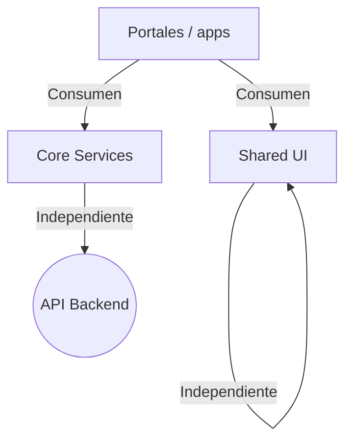

📍 **Ruta:** 📂 `client/angular` > 📄 `arquitectura-organizacion-monolito.md`

📅 **Última Revisión:** 09-Jul-2026
🛡️ **Estado:** Vigente (en revisión — corregido para reflejar estado real)
👤 **Responsable:** Agente (revisión)

---

# 🏗️ Propuesta de Organización: Monolito Modular (Modular Monolith)

Esta propuesta transiciona el cliente Angular de un **slicing técnico** (carpetas masivas `features/`, `core/`, `shared/`) hacia una **Arquitectura Basada en Dominios Verticales (Vertical Slicing / Modular Monolith)**, donde el código de negocio se agrupa por **portal de negocio** (`apps/{portal}`), facilitando mantenimiento, descubrimiento y futura extracción a Nx.

> [!IMPORTANT]
> **Este documento es el PLAN de verdad.** Existe otro archivo `architecture-axample.md` que propone una estructura distinta (basada en `features/` anidado con `web/`+`mobile/`). **Ambos documentos se contradicen.** Se decide adoptar esta propuesta (`apps/`) como estándar y retirar/`architecture-axample.md` como referencia histórica. No mezclar ambos en el código.

---

## 🎯 1. Resumen Ejecutivo (El "Por Qué")

| ❌ Estado Actual (Limitación) | ✅ Objetivo (Solución) |
| :--- | :--- |
| **Baja Cohesión:** Cambiar algo en *Nómina* tocaba `features/hr`, `core/services`, `shared/ui` y `routing/`. | **Alta Cohesión:** Todo lo de *RRHH* vive en `apps/recursos-humanos.luxuryapp/`. |
| **Dependencias Circulares:** `shared` y `core` se mezclan (hay `core/utils` y `core/pipes` que deberían ser `shared/`). | **Fronteras Estrictas:** Los portales no se importan entre sí; se comunican vía `core/`. |
| **Laberinto de descubrimiento:** `features/` tiene 9 dominios con subestructura inconsistente. | **Descubrimiento Rápido:** Falla "Sistemas" → vas a `apps/admin.luxuryapp/`. |

---

## 🔍 2. Estado Actual Real (Inventario — lo que YA existe)

Árbol real de `src/app/` (verificado 09-Jul-2026):

```text
src/app/
├── 🧱 core/                 # Infraestructura global (singleton)
│   ├── constants/  data/  directives/  enums/  helpers/  interfaces/
│   ├── models/  pages-extras/  testing/  utils/  pipes/  guard/
│   └── services/           # 95+ servicios (incluye auth.service, interceptores
│                            #   jwt-interceptor, offline.interceptor, swal, toast, etc.)
│
├── 🧩 shared/               # UI genérica (Design System)
│   ├── ui/                 # ✅ 391 componentes (web + mobile) — MADURO
│   ├── components/          # ⚠️ solo 2 — REDUNDANTE con shared/ui
│   ├── directives/  models/
│   └── (❌ NO tiene utils/ ni pipes/ — están en core/)
│
├── 📦 features/             # 9 dominios de negocio (Horizontal Slicing actual)
│   ├── accounting/  hr/  legal/  maintenance/  operations/
│   └── purchasing/  recruitment/  system/  web/
│
├── 🏗️ layout/              # ⚠️ TOP-LEVEL (fuera de core/): committee-view,
│   └── direccion-view, employee-view, shared
│
├── 🔐 login/               # ⚠️ TOP-LEVEL dentro de app/ (no en apps/auth)
│
└── 🚦 routing/            # ~40 archivos .routing.ts FRAGMENTADOS
    └── (mezcla routing/*.routing.ts + features/X/X.routing.ts)
```

**Hallazgos clave del inventario:**
1. `apps/` **NO existe** → es el trabajo central de migración.
2. `core/` **NO** tiene `auth/`, `layout/`, ni `http/` (la propuesta original los listaba).
3. `layout/` y `login/` son **top-level**, no bajo `core/` ni `apps/`.
4. `shared/` tiene `ui/` robusto, pero `utils/` y `pipes/` viven en `core/` (debe moverse).
5. `shared/components/` (2) es redundante con `shared/ui/` (391).
6. `routing/` ya usa **lazy loading** (`loadChildren`) — reutilizable, pero fragmentado.
7. No hay **enforcement de fronteras** (ni ESLint boundaries) → la "Regla de Oro" no es verificable hoy.

---

## 🗺️ 3. Estructura Propuesta (4 Pilares Corregidos)

```text
client/angular/src/app/
│
├── 🧱 core/               # Infraestructura y configuración global (Singleton)
│   ├── auth/              # ⚠️ MOVER AQUÍ: guards (de core/guard), auth.service, AuthState
│   ├── layout/            # ⚠️ MOVER AQUÍ: layout/ (committee/direccion/employee/shared)
│   ├── http/              # ⚠️ MOVER AQUÍ: interceptores (de core/services), error handling
│   ├── state/             # 🆕 Estado global compartido (Signals/NgRx) — ver §6
│   ├── services/          # Servicios transversales que SÍ son globales (swal, toast, storage)
│   └── (constants/ enums/ interfaces/ models/ helpers/ directives/ testing/ se conservan)
│
├── 🧩 shared/             # UI genérica y agnóstica al negocio (Design System)
│   ├── ui/                # ✅ Botones, Tablas, Modales, Badges (ya existe, 391)
│   ├── utils/             # 🔄 MOVER AQUÍ desde core/utils
│   └── pipes/             # 🔄 MOVER AQUÍ desde core/pipes
│       (directives/ models/ se conservan; FUSIONAR shared/components → shared/ui)
│
├── 📦 apps/               # 🚀 EL CORAZÓN: Portales de Negocio (Vertical Slices)
│   ├── admin.luxuryapp/      # 🛠️ Portal ADMINISTRATIVO (configuración global / back-office)
│   ├── system.luxuryapp/      # 💼 SYSTEM (módulo para USUARIO FINAL / usuario de sistemas; NO es "sistema de la app")
│   ├── superusuario.luxuryapp/ # 🔱 SUPERUSUARIO (SEPARADO; roles/permisos)
│   ├── auth.luxuryapp/       # 🔐 Autenticación y Recuperación (de login/)
│   ├── operations.luxuryapp/ # 💰 Operaciones + Compras + Comité/Dirección
│   ├── mantenimiento.luxuryapp/ # 🛠️ Mantenimiento operativo (de maintenance/)
│   ├── contabilidad.luxuryapp/  # 📊 Contabilidad (de accounting/)
│   ├── recursos-humanos.luxuryapp/ # 👥 RRHH (de hr/)
│   ├── reclutamiento.luxuryapp/   # 🎯 Reclutamiento (de recruitment/)
│   ├── legal.luxuryapp/           # ⚖️ Legal / Asuntos legales y seguros (de legal/)
│   ├── cobranza.luxuryapp/      # 💳 Cobranza / Recuperación de cartera (📋 PLANEADO)
│   ├── public.luxuryapp/     # 🌐 Portal Público / Landing
│   ├── resident.luxuryapp/   # 🏠 Residentes e Inquilinos (📋 PLANEADO — ver §4)
│   ├── security.luxuryapp/   # 🛡️ Control de Accesos (📋 PLANEADO)
│   ├── supplier.luxuryapp/   # 📦 Proveedores (📋 PLANEADO — lado compras)
│   └── web.luxuryapp/       # 📣 Web publicitaria / Marketing (cotizadores, ejemplos de la app)
│
└── 🚦 routing/            # Enrutador Maestro (lazy loading hacia cada portal en apps/)
```

### Anatomía Interna de un Portal (ej. `apps/admin.luxuryapp/`)

```text
apps/admin.luxuryapp/
├── 📄 admin.routes.ts        # Rutas exclusivas del portal (lazy loaded)
├── 📂 components/            # UI exclusiva del portal (ej. admin-employee-card)
├── 📂 pages/                 # Vistas enrutables (ej. hr-dashboard.ts)
├── 📂 services/              # Servicios de API del portal (ej. api/hr/employees)
├── 📂 models/                # DTOs e Interfaces (EmployeeDTO)
└── 📄 INDEX.ts               # Punto de entrada estricto (Public API)
```

---

## 🧭 4. Mapa de Migración `features/*` → `apps/*` (Pieza Faltante)

Esta es la tabla explícita que resuelve la propuesta original. Mapea los 9 dominios actuales a los portales:

| Portal (`apps/`) | Dominios `features/` origen | Layouts / extras | Estado |
| :--- | :--- | :--- | :--- |
| **admin.luxuryapp** | (configuración global / back-office de la app) | 🛠️ **Portal ADMINISTRATIVO** — NO es el módulo "system", NO es superusuario | 🔄 Migrar |
| **system.luxuryapp** | `system/` | 💼 **SYSTEM** = módulo de negocio para el **USUARIO FINAL** (usuario de sistemas). ⚠️ NO es "sistema de la app" (infra) | 🔄 Migrar |
| **superusuario.luxuryapp** | (roles/permisos: `asp-role.service`, `module-permission.service`) | 🔱 **SUPERUSUARIO** — SEPARADO de admin y de system | 🔄 Migrar |
| **auth.luxuryapp** | — | `login/` (top-level) | 🔄 Mover |
| **operations.luxuryapp** | `operations/`, `purchasing/` | `layout/committee-view`, `layout/direccion-view` (re-asignados de `corporate` eliminado) | 🔄 Migrar |
| **mantenimiento.luxuryapp** | `maintenance/` | — | 🔄 Migrar |
| **contabilidad.luxuryapp** | `accounting/` | — | 🔄 Migrar |
| **recursos-humanos.luxuryapp** | `hr/` | — | 🔄 Migrar |
| **reclutamiento.luxuryapp** | `recruitment/` | — | 🔄 Migrar |
| **legal.luxuryapp** | `legal/` (`asuntos-legales-y-seguros`) | — | 🔄 Migrar |
| **cobranza.luxuryapp** | — | 💳 **Cobranza** / recuperación de cartera | 📋 PLANEADO |
| **web.luxuryapp** | `web/` | 📣 **Web publicitaria / Marketing** de la app: cotizadores, ejemplos, landing corporativo (sitio externo, NO es el área pública de la app) | 🔄 Migrar |
| **public.luxuryapp** | — | `routing/public.routing.ts` | 🔄 Cablear |
| **resident.luxuryapp** | — | ❌ Sin features hoy | 📋 PLANEADO |
| **security.luxuryapp** | — | ❌ Sin features hoy | 📋 PLANEADO |
| **supplier.luxuryapp** | (lado proveedor de `purchasing/`) | ❌ Sin features hoy | 📋 PLANEADO |

> [!NOTE]
> **`corporate.luxuryapp` ELIMINADO (decisión 09-Jul-2026).** Su contenido se reasigna:
> `committee`/`direccion` (antes bajo `operations/`) y los layouts `committee-view`/`direccion-view`
> ahora viven en **`operations.luxuryapp`**. No existe portal `corporate`.
>
> **`admin.luxuryapp`** = Portal ADMINISTRATIVO (configuración global / back-office). **NO** es el módulo "system" (ese es `system.luxuryapp`, para usuario final) ni superusuario (ese es `superusuario.luxuryapp`). Véase §9 para la distinción exacta.
> **`recursos-humanos.luxuryapp`** = RRHH (de `hr/`), independiente de los anteriores.
>
> [!NOTE]
> **`web.luxuryapp` vs `public.luxuryapp` (no confundir):**
> - `public.luxuryapp` = **área pública DENTRO de la app** (rutas de acceso libre, `routing/public.routing.ts`).
> - `web.luxuryapp` = **sitio web publicitario / marketing EXTERNO** (cotizadores, ejemplos, landing corporativo).
> Son portales distintos con propósitos distintos.

---

## 📊 5. Reglas de Arquitectura y Dependencias

Flujo unidireccional estricto:



> [!WARNING]
> **Regla de Oro:**
> Los portales **NUNCA** deben depender el uno del otro directamente. Si `admin.luxuryapp` necesita datos de `operations.luxuryapp`, comuníquese vía servicio global en `core/` o vía Signals/eventos — **nunca** importando componentes cruzados.

### 🎨 Regla de UI — Gateway al Design System (`shared/ui/`)

> [!WARNING]
> **PROHIBIDO usar componentes nativos de PrimeNG / Ionic / otra librería directamente dentro de `apps/`.**
> Dentro de **cualquier** componente de `apps/{portal}/` (`pages/`, `components/`, `services/`):
> - ❌ NO se importa ni declara `p-button`, `p-table`, `p-dialog`, `ButtonModule`, `TableModule`, `IonButton`, `ion-button`, `IonInput`, etc. directamente.
> - ✅ SIEMPRE se usa el wrapper custom de `shared/ui/` (ej. `iw-button-*`, `il-button-*`, `ii-button-*`, `ili-button-*`, `lx-*`, tablas, modales, etc.).
>
> **Razón (el beneficio real):** `shared/ui/` es la **ÚNICA capa de presentación**. Si mañana se elimina PrimeNG, se cambia a otra librería, o se ajusta el botón `X`, el cambio se aplica **UNA sola vez** en `shared/ui/` y se propaga a **todo el sistema** — en lugar de editar componente por componente en los 15 portales.
>
> **Excepción (solo `shared/ui/`):** Únicamente `shared/ui/` puede importar librerías externas (PrimeNG/Ionic). `core/` puede usarlas solo si es infra transversal justificada (ej. toast/loading global vía `custom-toast.service`), y `apps/` **nunca** lo hace.

### 🚦 Regla de Rutas — Prefijo de Portal (Namespacing)

> [!WARNING]
> **Todas las rutas de un portal deben estar prefijadas con el slug del portal.**
> - El **slug** = la parte del nombre de carpeta **antes de `.luxuryapp`** (ej. `auth.luxuryapp` → slug `auth`; `operations.luxuryapp` → slug `operations`).
> - El router maestro (`app.routes.ts`) registra **un solo** `loadChildren` por portal con el path raíz = slug, y cada portal define sus rutas **relativas** a ese slug en `apps/{portal}/{portal}.routes.ts`.
> - ✅ Ejemplo `auth.luxuryapp`: `app.routes.ts` → `{ path: "auth", loadChildren: () => import("apps/auth.luxuryapp/auth.routes").then(m => m.authRoutes) }`; dentro → `login`, `recover`, `reset`. **URL final = `/auth/login`.**
> - ❌ Prohibido rutas "sueltas" sin prefijo (ej. definir `login` en lugar de `auth/login`) — causaría colisión de paths entre los 16 portales.
>
> **Razón:** el namespacing por portal evita colisiones de ruta, hace el router maestro trivial (1 `loadChildren` por portal) y deja el dominio de negocio explícito en la URL.

> [!CAUTION]
> **ENFORCEMENT REQUERIDO (faltante hoy):** La Regla de Oro y la Regla de UI no son verificables sin herramientas. **Acción obligatoria:** agregar `eslint-plugin-boundaries` (o equivalente) con reglas que:
> 1. Prohíban imports cruzados `apps/* → apps/*` (Regla de Oro).
> 2. Prohíban imports de `primeng/*` e `@ionic/angular*` dentro de `apps/**` (Regla de UI) — solo `shared/ui` los puede consumir.
> 3. Fuerce `core/*`/`shared/*` como únicos consumibles compartidos.
> 4. El **prefijo de ruta** (🚦 Regla de Rutas) se valida por **convención en revisión de PR** (y opcionalmente con un script/CI o regla ESLint custom que chequee que cada `{portal}.routes.ts` solo declare paths relativos al slug). Sin esto, la arquitectura se degrada en la práctica.

---

## 🧠 6. Capa de Estado Compartido

La propuesta original omitió la capa de estado. El proyecto **YA usa Angular Signals** (`PlatformService`, `layout.service`, etc.), por lo que se estandariza:

- **Estado global transversal** (auth, usuario, tema, conectividad) → `core/state/`.
- **Estado de portal** (listas, filtros de un dominio) → dentro de `apps/{portal}/services/` o un `state.ts` local del portal.
- Prohibido estado en `shared/` (debe ser puro/presentacional).

---

## ✅ 7. Criterios de Éxito y Checklist (Actualizado con Realidad)

| # | Criterio | Estado Hoy | Acción |
| :--- | :--- | :--- | :--- |
| 1 | `features/` desaparece y se reubica en `apps/` | ❌ 0% (9 dominios → 16 portals en el plan) | Migración incremental portal-por-portal |
| 2 | UI reutilizable de vistas extraída a `shared/ui/` | ✅ ~Hecho (391 componentes) | Auditoría final de `features/` tras migrar |
| 3 | `core/services` se reduce ~80% | ❌ 95+ servicios | Mover servicios de dominio a `apps/{portal}/services/` |
| 4 | Lazy loading por portal en `app.routes.ts` | ✅ Parcial (ya existe por feature) | Re-enlazar `loadChildren` a `apps/{portal}/{portal}.routes.ts` |
| 5 | `shared/utils` + `shared/pipes` existen | ❌ Están en `core/` | Mover `core/utils`+`core/pipes` → `shared/` |
| 6 | `core/auth` + `core/layout` + `core/http` existen | ❌ Dispersos | Consolidar guards/interceptores/layout en `core/` |
| 7 | Enforce de fronteras (Regla de Oro) | ❌ Ausente | Agregar `eslint-plugin-boundaries` |
| 8 | `INDEX.ts` como Public API en cada portal | ❌ Solo 7 en `features/` | Estandarizar en `apps/{portal}/INDEX.ts` |
| 9 | Regla de UI: NO PrimeNG/Ionic nativo en `apps/` (solo `shared/ui/`) | ❌ No enforce | ESLint que bane `primeng/*`+`@ionic/angular*` en `apps/**` |
| 10 | Regla de Rutas: prefijo de portal en paths (`auth/login`) | ❌ No enforce | Convención en PR + script/CI que valide slug |

---

## 🧭 8. Plan de Ejecución por Fases (Solo Plan — NO se ejecuta aún)

- **Fase 0 — Preparación (文档/tooling):** Unificar con `architecture-axample.md`; definir mapa §4; agregar ESLint boundaries; decidir destino de `legal/`.
- **Fase 1 — Infraestructura `core/`:** Crear `core/auth`, `core/layout`, `core/http`, `core/state`; mover guards/interceptores/layout desde ubicaciones actuales.
- **Fase 2 — `shared/`:** Mover `core/utils`+`core/pipes` → `shared/`; fusionar `shared/components` → `shared/ui`.
- **Fase 3 — `apps/` scaffold:** Crear los 16 portales con anatomía interna (carpetas + `{portal}.routes.ts` + `INDEX.ts`).
- **Fase 4 — Migración por portal (la más grande):** Mover `features/*` → `apps/{portal}/*` usando `migrate.ps1` como patrón de re-importación; cablear `loadChildren` en `app.routes.ts`.
- **Fase 5 — Limpieza:** Eliminar `features/`; verificar bundle inicial reducido; validar fronteras con lint.

> [!TIP]
> **Beneficio Real:** En este estado modular (Domain-Driven), extraer un dominio a Nx es "copiar y pegar" el portal, sin desenredar dependencias ocultas.

---

## 📌 9. Conflictos Conocidos y Notas

- **Doble documento de arquitectura:** `arquitectura-organizacion-monolito.md` (este, usa `apps/`) vs `architecture-axample.md` (usa `features/` anidado con `web/`+`mobile/`). **Resolución:** este documento es el estándar; `architecture-axample.md` pasa a referencia histórica y no debe seguirse.
- **`login/` y `layout/` top-level:** No cumplen la propuesta; deben moverse a `apps/auth.luxuryapp/` y `core/layout/` respectivamente (Fase 1/4).
- **`corporate.luxuryapp` ELIMINADO (09-Jul-2026):** No existe en el plan. Su contenido (`committee`/`direccion` + layouts) se reasignó a `operations.luxuryapp`.
- **`admin.luxuryapp` = Portal ADMINISTRATIVO:** configuración global / back-office de la app. NO es el módulo "system" ni superusuario.
- **`system.luxuryapp` = módulo para USUARIO FINAL (usuario de sistemas):** viene de `features/system/`. ⚠️ NO es "sistema de la app" (infraestructura/core). Es un dominio de negocio de cara al usuario final.
- **`superusuario.luxuryapp` SEPARADO:** Superusuario es su propio portal (roles/permisos), independiente de `admin.luxuryapp` y de `system.luxuryapp`. No se mezclan.
- **`shared/components` vs `shared/ui`:** Redundancia; fusionar en Fase 2.
- **`migrate.ps1` / `migrate-buttons.ps1` existentes:** Útiles como base de re-importación de rutas en la migración.
