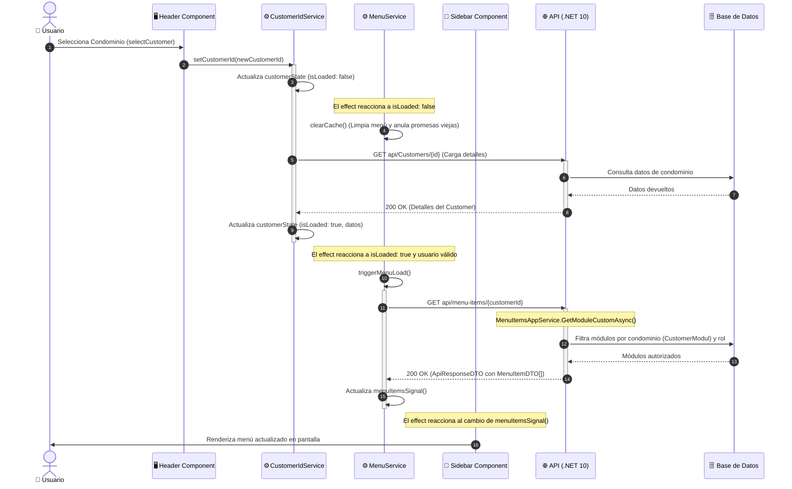

# 🚀 Flujo de Trabajo: Selección de Customer y Recarga Dinámica del Menú

Este documento detalla la arquitectura, el flujo de ejecución de extremo a extremo y el diagnóstico de soluciones implementadas para el sistema de selección de clientes (`Customer`) y la recarga dinámica de menús adaptativos basados en roles y permisos multi-tenant.

---

## 🗺️ Arquitectura del Flujo (Frontend a Backend)

El siguiente diagrama de secuencia representa la interacción completa entre el selector de la interfaz de usuario, los servicios reactivos del cliente de Angular, el servidor API en .NET 10 y el almacenamiento de base de datos:



---

## 🔍 Diagnóstico e Inconsistencias Corregidas

Durante la auditoría del flujo, se detectaron dos puntos de falla críticos que provocaban que el menú lateral no se recargara de manera consistente:

### 1. Desconexión del Login Silencioso y Carga del Menú
> [!WARNING]
> Al iniciar la aplicación o refrescar la página, el servicio `CustomerIdService` cargaba rápidamente el ID del customer desde el almacenamiento local (`localStorage`) y marcaba el estado como listo (`isLoaded: true`). Sin embargo, la autenticación mediante login silencioso (`trySilentLogin()`) es asíncrona y tardaba más tiempo.

* **Falla**: Cuando el `effect` de `MenuService` intentaba cargar el menú, el `applicationUserId` en `AuthService` era `null`, haciendo que la carga abortara.
* **Causa**: `applicationUserId` era un getter síncrono no reactivo de Angular. Al cambiar de `null` a su valor final tras el refresco del token, el `effect` de `MenuService` **no** se volvía a ejecutar, dejando el menú vacío de forma permanente.
* **Solución**: Se integró `toSignal(this.authS.userToken$)` como dependencia reactiva en el `effect` del constructor de `MenuService`, de forma que cuando el token se inicializa, el menú se recarga de manera inmediata y automática.

### 2. Condiciones de Carrera con Promesas Huérfanas (`menuLoadPromise`)
> [!IMPORTANT]
> El servicio `MenuService` utiliza una propiedad `menuLoadPromise` para almacenar la promesa de la petición HTTP y evitar múltiples llamadas duplicadas en paralelo.

* **Falla**: Al cambiar de condominio, se llamaba a `clearCache()`, pero este método no restablecía la variable `menuLoadPromise` a `null`.
* **Causa**: Si una llamada de menú previa estaba en curso durante el cambio de condominio, `menuLoadPromise` retenía la promesa vieja. Al marcar el nuevo condominio como cargado, `triggerMenuLoad()` reutilizaba la promesa del condominio anterior, provocando que se ignorara la carga del nuevo menú o se sobrescribiera con los datos viejos.
* **Solución**: Se actualizó `clearCache()` para anular de inmediato la promesa anterior (`this.menuLoadPromise = null`), deteniendo cualquier condición de carrera y forzando una consulta limpia al API para el nuevo cliente.

---

## 🛠️ Especificación Técnica en el Backend

El backend en .NET 10 procesa la solicitud mediante un enfoque de **Vertical Slices** y consultas directas proyectadas manualmente en base de datos para máxima velocidad:

### 1. Endpoint del Controlador
El controlador expone el método HTTP GET bajo el segmento `api/menu-items`:
```csharp
[Route("api/menu-items")]
[ApiController]
public class MenuItemsController(IMenuItemsAppService appService) : ControllerBase
{
    [HttpGet("{customerId}")]
    public async Task<ActionResult<ApiResponseDTO<List<MenuItemDTO>>>> GetMenuItemCustomAsync(Guid customerId)
        => await appService.GetModuleCustomAsync(customerId);
}
```

### 2. Servicio de Aplicación (`MenuItemsAppService.cs`)
El método `GetModuleCustomAsync` realiza los siguientes pasos estructurados:
1. **Validación de Identidad**: Obtiene el ID y los roles del usuario autenticado a través de `ICurrentUserService`. Si no hay sesión o roles, retorna una lista vacía.
2. **Filtro de Módulos por Condominio**: Consulta la tabla `CustomerModul` para obtener únicamente los módulos habilitados y pagados por el cliente actual (`customerId`).
3. **Filtro de Permisos por Rol**: Cruza los módulos resultantes con la tabla `ModuleAppRol` para limitar el acceso según los roles actuales del usuario en el sistema.
4. **Construcción del Árbol Jerárquico**: Agrupa los módulos que contienen un `PathParent` (módulos hijos) bajo sus correspondientes módulos padres (`MenuItemDTO`), y deja los módulos planos como elementos independientes de primer nivel.
5. **Proyección y Ordenamiento**: Proyecta manualmente a DTOs para evitar el uso de AutoMapper (siguiendo las reglas de oro de `GEMINI.md`) y ordena el menú final alfabéticamente por la propiedad `NameModule`.

---

## 💡 Consejos de Implementación y Mantenimiento

> [!TIP]
> **Cambios de Customer en Vistas Específicas**: Al cambiar de condominio en el selector general, es altamente recomendable redirigir al usuario al dashboard principal (`/dashboard`) para evitar errores de carga en componentes de páginas que no correspondan a los módulos permitidos del nuevo condominio.

> [!NOTE]
> Todos los identificadores únicos y claves primarias cruzadas entre el frontend y el backend para los condominios son siempre representados con el tipo de datos **Guid** estándar.

---

¡Esperamos que esta guía de arquitectura y análisis te sea de gran utilidad para comprender el funcionamiento adaptativo del menú dinámico en la plataforma! 🚀-😊
