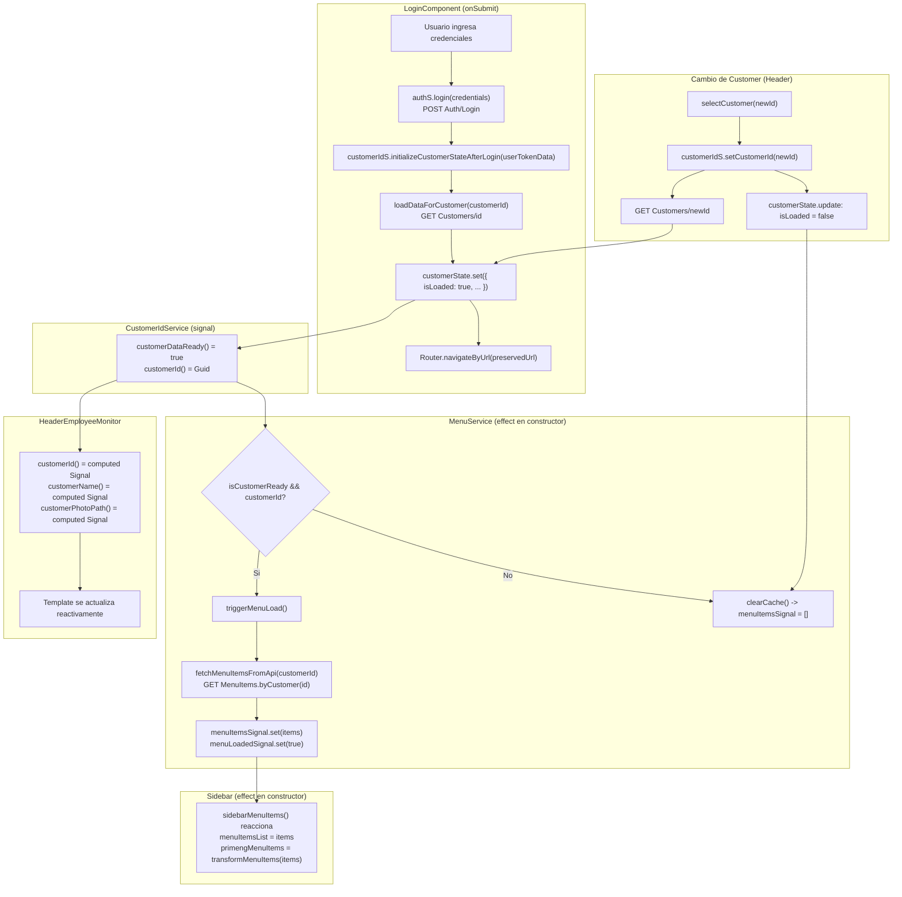

# Analisis de Flujo de Servicios: Login, CustomerID y Menu

**Fecha:** Junio 2026  
**Archivos auditados:**  
- `customer-id.service.ts`  
- `api-response.service.ts`  
- `login/login.ts` + `login.html`  
- `sidebar/sidebar.ts` + `sidebar.html`  
- `menu.service.ts`  
- `auth.service.ts`  
- `header-employee-monitor/header-employee-monitor.ts` + `.html`

---

## 1. Diagrama de Flujo (Mermaid)



---

## 2. Mapa de Conexiones y Estado

### Grafo de dependencias (inyeccion)

```
LoginComponent
  -> AuthService
  -> CustomerIdService

AuthService
  -> CustomerIdService   (clearSession)
  -> SignalRService      (lazy via Injector)
  -> HttpClient (x2: con y sin interceptores)

CustomerIdService
  -> StorageService
  -> HttpClient
  -> NgZone

MenuService
  -> CustomerIdService   (lee customerDataReady, customerId via effect)
  -> AuthService         (lee applicationUserId)
  -> ApiResponseService

ApiResponseService
  -> DataConnectorService
  -> CustomToastService
  -> GlobalErrorService
  -> LoaderService

Sidebar
  -> MenuService
  -> CustomerIdService
  -> AuthService
  -> Router

HeaderEmployeeMonitor
  -> CustomerIdService
  -> AuthService
  -> MenuService
  -> AspRoleService
  -> ThemeService, SearchService, HidescrollnavService, ...
```

### Estado compartido y mecanismo de propagacion

| Estado | Propietario | Tipo | Consumidores |
|---|---|---|---|
| customerState (id, nombreCorto, photoCustomer, isLoaded) | CustomerIdService | `signal` privado + computed publicos | MenuService (effect), Sidebar, HeaderEmployeeMonitor |
| currentUserSession | AuthService | `BehaviorSubject<UserTokenDTO>` | LoginComponent (via login$), Sidebar, HeaderEmployeeMonitor |
| menuItemsSignal | MenuService | `signal<IMenuItem[]>` | Sidebar (effect) |
| menuLoadedSignal, menuLoadingSignal | MenuService | `signal<boolean>` | Sidebar (loading) |
| collapseSidebar | MenuService | propiedad mutable | HeaderEmployeeMonitor (sidebarToggle), Sidebar |

### Puntos de llamada a API

| Llamada | Quien | Cuando |
|---|---|---|
| `POST Auth/Login` | AuthService.login | submit del form |
| `POST Auth/Refresh` | AuthService.refreshToken | silent login en constructor |
| `GET Customers/{id}` | CustomerIdService.loadDataForCustomer | post-login y cambio de customer |
| `GET MenuItems.byCustomer(id)` | MenuService.fetchMenuItemsFromApi | cuando customerDataReady=true |

---

## 3. Auditoria de Politicas (GEMINI.md)

### Tipado estricto (no "any")

| Archivo | Linea | Violacion |
|---|---|---|
| `customer-id.service.ts` | 116 | `.get<any>(...)` — debe tiparlo con la interfaz de respuesta |
| `customer-id.service.ts` | 119 | `tap((response: any) => {...})` — tipo anonimo, sin verificar `response.success` |
| `api-response.service.ts` | 183 | `httpParams?: any` — parametro sin tipo en onGetList/onGetPaged/etc |
| `api-response.service.ts` | 298 | `data: any = null` en onPost, onPut, onPatch, etc |
| `api-response.service.ts` | 202 | `catch (error)` accede a `error.error?.Message` sin type assertion |
| `auth.service.ts` | 118 | `login(credentials: any)` |
| `header-employee-monitor.ts` | 277 | `selectCustomer(newCustomerId: any)` |

### Manejo de memoria (unsubscribe / takeUntilDestroyed)

| Archivo | Problema |
|---|---|
| `login.ts` | Usa patron viejo `Subject+takeUntil+ngOnDestroy`. Debe usar `takeUntilDestroyed(this.destroyRef)` |
| `api-response.service.ts` | `onDownloadFile`, `onDownloadFilePost`, `onPreviewPdf` usan `.subscribe()` con `takeUntil(this.destroy$)` — el `destroy$` nunca emite en produccion (singleton, `ngOnDestroy` no se llama). Suscripciones sin limpieza garantizada. |
| `api-response.service.ts` | `private destroy$` en un servicio `providedIn: root` es un patron incorrecto. `ngOnDestroy` en servicios singleton no se invoca en el ciclo normal de la aplicacion. |

### Uso de componentes Standalone

`Sidebar`, `HeaderEmployeeMonitor` y `LoginComponent` no declaran `standalone: true` explicitamente (Angular 21 lo asume si no hay NgModule). Se debe validar con el equipo si el proyecto tiene NgModules activos o usa standalone puro. No hay evidencia de violacion directa pero si de inconsistencia.

### Separacion de responsabilidades

- `ApiResponseService` mezcla HTTP, validacion de formularios (`validateForm(form: FormGroup)`), descarga de archivos y manejo de errores. Viola el principio de responsabilidad unica.
- `LoginComponent` guarda credenciales en localStorage directamente (deberia delegarlo a un `StorageService` o `SecurityService`).

### Emojis en codigo (GEMINI.md prohibido)

Todos los archivos auditados usan emojis en logs: `"✅"`, `"🧹"`, `"🚀"`, `"🎉"`, `"📥"`, `"📊"`, etc. Esto viola el mandato: *"Prohibido el uso de simbolos raros, emojis o caracteres especiales no estandar en codigo, comentarios o documentacion."*

Archivos afectados: `api-response.service.ts`, `menu.service.ts`, `auth.service.ts`, `login.ts`, `customer-id.service.ts`.

### Uso de Signals vs @Input/@Output

`HeaderEmployeeMonitor` usa `input<boolean>()` (signal input de Angular, correcto). El resto de la comunicacion entre servicios usa Signals correctamente. No se detectaron `@Input()` ni `@Output()` activos.

---

## 4. Hallazgos de Fallos y Bugs (CRITICO)

---

### BUG-01 [CRITICO] `CustomerIdService.loadDataForCustomer` — no verifica `response.success`

**Archivo:** `customer-id.service.ts:119`

```typescript
tap((response: any) => {
  this.customerState.set({
    id: response.data.id,          // NO verifica response.success antes
    nombreCorto: response.data.nombreCorto,
    ...
    isLoaded: true,
  });
})
```

**Impacto:** Si la API retorna `{ success: false, data: null, message: "..." }`, el acceso a `response.data.id` lanza `TypeError: Cannot read properties of null`. El estado queda con `isLoaded: false` (el `catchError` lo maneja), pero el error no es controlado como un fallo de negocio sino como una excepcion no esperada. El `MenuService` nunca cargara el menu y la app quedara en estado de loading infinito.

---

### BUG-02 [CRITICO] `ApiResponseService` — `destroy$` singleton inutil y peligroso

**Archivo:** `api-response.service.ts:27`

```typescript
private destroy$ = new Subject<void>();
// ...en cada metodo:
.pipe(takeUntil(this.destroy$))
// ...
ngOnDestroy(): void {
  this.destroy$.next();
  this.destroy$.complete();
}
```

**Impacto:** `ApiResponseService` es `providedIn: 'root'` (singleton). `ngOnDestroy` en servicios singleton **nunca se llama** durante el ciclo de vida normal de la aplicacion — solo al destruir el injector raiz (cerrar la app). Esto tiene dos consecuencias:

1. El `takeUntil(this.destroy$)` es un no-op en produccion: no cancela ninguna peticion cuando se destruye un componente.
2. Si en algun contexto (tests, componentes que inyectan el servicio de forma no raiz) se invoca `ngOnDestroy`, **todas las peticiones en vuelo de toda la app se cancelan simultaneamente**, incluyendo las de otros componentes no relacionados.

Los metodos `onDownloadFile`, `onDownloadFilePost` y `onPreviewPdf` usan `.subscribe()` directamente (sin `async/await`) y dependen de este `destroy$`. Sus suscripciones quedan activas sin mecanismo de limpieza real.

---

### BUG-03 [CRITICO] `Sidebar` — acceso a `infoAccountAuthDTO` null en inicializacion

**Archivo:** `sidebar.ts:49-51`

```typescript
public infoAccountAuthDTO = this.authS.infoUserAuth;  // puede ser null
public profileImageUrl: string = this.infoAccountAuthDTO.photoPath;  // TypeError si null
```

**Archivo:** `sidebar.html:25-30`

```html
<h2>{{ infoAccountAuthDTO.fullName }}</h2>
<p>{{ infoAccountAuthDTO.position || 'En linea' }}</p>
```

**Impacto:** `AuthService.infoUserAuth` retorna `InfoAccountAuthDTO | null`. Durante el silent login inicial (que es asincronico), el sidebar se monta antes de que `currentUserSession` tenga valor. La asignacion `this.infoAccountAuthDTO.photoPath` se ejecuta en la declaracion de la propiedad (antes del constructor) y lanza un `TypeError` si `infoUserAuth` es null. El template tampoco tiene guard (`?.`), lo que causa el mismo crash si el componente se renderiza con sesion nula.

---

### BUG-04 [CRITICO] `LoginComponent` — contrasena guardada en texto plano en localStorage

**Archivo:** `login.ts:246`

```typescript
localStorage.setItem("savedPassword", password);
```

**Impacto:** La contrasena del usuario se persiste en `localStorage` sin ninguna forma de cifrado. Cualquier script en la pagina (incluyendo XSS) puede leerla con `localStorage.getItem("savedPassword")`. Esto es una vulnerabilidad de seguridad grave — violacion OWASP A02 (Cryptographic Failures).

---

### BUG-05 [CRITICO] `AuthService` — SignalR no se inicia en el flujo de login normal

**Archivo:** `auth.service.ts:197-201`

```typescript
public notifyLoginSuccess(sessionData: UserTokenDTO): Observable<boolean> {
  this.currentUserSession.next(sessionData);
  this.signalRService.start();   // SignalR solo arranca aqui
  return of(true);
}
```

**Archivo:** `auth.service.ts:118-137` (`login()`)

```typescript
login(credentials: any): Observable<UserTokenDTO> {
  return this.http.post(...)
    .pipe(
      tap((session) => {
        this.currentUserSession.next(session);  // Sesion actualizada...
      }),                                        // ...pero SignalR NO se inicia
      catchError(this.handleError),
    );
}
```

**Impacto:** `LoginComponent` llama a `authS.login()` directamente. La sesion se establece pero `signalRService.start()` nunca se ejecuta. El mismo problema ocurre con `trySilentLogin()` / `refreshToken()`. La conexion SignalR (notificaciones en tiempo real) nunca se establece despues de autenticarse, lo que deja features de notificacion rotas hasta que el usuario realice alguna accion que llame a `notifyLoginSuccess`.

---

### BUG-06 [MODERADO] `MenuService` — `lastCustomerId` se actualiza tarde: race condition con cambios rapidos

**Archivo:** `menu.service.ts:106-109` y `173-175`

```typescript
// en triggerMenuLoad:
if (this.menuLoadedSignal() && this.lastCustomerId === customerId) {
  return; // early exit basado en lastCustomerId
}

// en fetchMenuItemsFromApi, AL FINAL de la carga:
this.lastCustomerId = customerId;
```

**Impacto:** Si el usuario cambia de customer mientras una carga esta en curso, `lastCustomerId` aun apunta al customer anterior. Una segunda llamada a `triggerMenuLoad` con el nuevo ID no encontrara early exit (correcto), pero si la primera carga llega al `finally` antes de que la segunda comience, `menuLoadPromise = null` y la segunda carga iniciara una nueva fetch. Esto es correcto en la mayoria de casos pero puede causar que el menu muestre datos del customer anterior brevemente si el `menuLoadedSignal` se puso `true` antes de que `lastCustomerId` se actualice.

---

### BUG-07 [MODERADO] `Sidebar` — propiedades mutables mezcladas con effects de Signals

**Archivo:** `sidebar.ts:54-58` y `77-81`

```typescript
public menuItemsList: IMenuItem[] = [];       // No es Signal
public allMenuItems: IMenuItem[] = [];        // No es Signal

constructor() {
  effect(() => {
    const items = this.menuService.sidebarMenuItems();
    this.menuItemsList = items;               // Asignacion mutable
    this.allMenuItems = JSON.parse(JSON.stringify(items));
  });
}
```

**Impacto:** Si el componente usa `ChangeDetectionStrategy.OnPush` (o si Angular optimiza el change detection), los cambios a `menuItemsList` y `allMenuItems` via efecto pueden no disparar la re-renderizacion del template. El metodo `searchTerm()` y `clearSearch()` leen de `allMenuItems` (mutable), lo que puede mostrar resultados de busqueda del customer anterior despues de un cambio.

---

### BUG-08 [MODERADO] `HeaderEmployeeMonitor` — `cb_customer` se asigna una sola vez al construir

**Archivo:** `header-employee-monitor.ts:85`

```typescript
public cb_customer: ISelectItem[] = this.authS.customerAccess;
```

`customerAccess` es un getter que lee `currentUserSession.value?.customerAccess`. Esta asignacion se ejecuta una sola vez durante la construccion del componente. Si la sesion se actualiza despues (ej. silent refresh), `cb_customer` no se actualiza porque no es un Signal ni un Observable con subscription. El selector de condominios puede mostrar una lista desactualizada o vacia.

---

## 5. Plan de Accion y Correcciones

### Correccion BUG-01: Verificar `response.success` en `loadDataForCustomer`

**Archivo:** `customer-id.service.ts`

Definir una interfaz tipada para la respuesta:

```typescript
// Agregar en customer-id.service.ts o importar de api-response.service.ts
interface CustomerDetailDTO {
  id: string;
  nombreCorto: string;
  photoPath: string;
  nameCustomer: string;
}
```

Reemplazar el metodo `loadDataForCustomer`:

```typescript
private loadDataForCustomer(customerId: string): Observable<boolean> {
  if (!customerId) {
    this.clearCustomerData();
    return of(false);
  }

  return this.http
    .get<ApiResponseDTO<CustomerDetailDTO>>(`${environment.API_BASE_URL}Customers/${customerId}`)
    .pipe(
      tap((response) => {
        if (!response.success || !response.data) {
          this.consoleLogger.error(
            '[CustomerIdService] API retorno error o datos nulos.',
            response.message,
          );
          this.zone.run(() => {
            this.customerState.update((s) => ({ ...s, isLoaded: false }));
          });
          return;
        }
        this.zone.run(() => {
          this.customerState.set({
            id: response.data.id,
            nombreCorto: response.data.nombreCorto,
            photoCustomer: response.data.photoPath,
            customerName: response.data.nameCustomer,
            isLoaded: true,
          });
        });
      }),
      map((response) => response.success && !!response.data),
      catchError((error) => {
        this.consoleLogger.error('[CustomerIdService] API call FAILED.', error);
        this.zone.run(() => {
          this.customerState.update((s) => ({ ...s, isLoaded: false }));
        });
        return of(false);
      }),
    );
}
```

---

### Correccion BUG-02: Eliminar `destroy$` singleton de `ApiResponseService`

El `takeUntil(this.destroy$)` debe eliminarse de todos los metodos `async` (los que usan `lastValueFrom`) porque `lastValueFrom` ya maneja la suscripcion automaticamente. Para `onDownloadFile`, `onDownloadFilePost` y `onPreviewPdf`, el `takeUntil` no tiene mecanismo de disparo valido, por lo que debe eliminarse:

```typescript
// ANTES (incorrecto):
const responseData = await lastValueFrom(
  this.dataConnectorS
    .get<ApiResponseDTO<T>>(urlApi, httpParams)
    .pipe(takeUntil(this.destroy$)),  // <- eliminar
);

// DESPUES (correcto):
const responseData = await lastValueFrom(
  this.dataConnectorS.get<ApiResponseDTO<T>>(urlApi, httpParams),
);
```

Para los metodos que usan `.subscribe()` directamente (`onDownloadFile`, etc.), si se desea limpieza al destruir el componente invocador, el componente debe gestionar la cancelacion pasando un `DestroyRef` o un `Subject` externo. La forma mas sencilla es convertirlos a `async`:

```typescript
async onDownloadFile(urlApi: string, nameDocument: string): Promise<void> {
  this.loaderS.show();
  try {
    const resp = await lastValueFrom(this.dataConnectorS.getFile(urlApi));
    const blob = new Blob([resp], { type: resp.type });
    saveAs(blob, nameDocument);
    this.customToastService.showSuccess('Completado', 'El archivo se descargo correctamente.');
  } catch (error: unknown) {
    const errorMessage = (error as { error?: { Message?: string } }).error?.Message
      ?? 'No se pudo completar la operacion.';
    this.customToastService.showError('Error', errorMessage);
    this.globalErrorService.setGlobalError(errorMessage);
    this.consoleLogger.error('API Error', error);
  } finally {
    this.loaderS.hide();
  }
}
```

Adicionalmente, eliminar `ngOnDestroy`, `private destroy$` y la importacion de `Subject`, `finalize`.

---

### Correccion BUG-03: Guard en `Sidebar` para `infoAccountAuthDTO` null

**Archivo:** `sidebar.ts`

```typescript
// Declaracion de propiedad: usar getter con guard
public get infoAccountAuthDTO(): InfoAccountAuthDTO {
  return this.authS.infoUserAuth ?? {
    fullName: '',
    position: '',
    photoPath: '',
    applicationUserId: '',
  } as InfoAccountAuthDTO;
}

// Eliminar la asignacion problematica en la propiedad de clase:
// public profileImageUrl: string = this.infoAccountAuthDTO.photoPath;  <- ELIMINAR

// Y convertirlo a getter:
public get profileImageUrl(): string {
  return this.authS.infoUserAuth?.photoPath ?? 'assets/images/default-avatar.png';
}
```

**Archivo:** `sidebar.html` — agregar `?.` o default en el template:

```html
<h2>{{ infoAccountAuthDTO?.fullName }}</h2>
<p>{{ infoAccountAuthDTO?.position || 'En linea' }}</p>
```

---

### Correccion BUG-04: Eliminar almacenamiento de contrasena en texto plano

**Archivo:** `login.ts:241-255`

```typescript
onRemember(rememberMe: boolean): void {
  if (rememberMe) {
    const username = this.loginForm.get('userName')?.value;
    if (username) {
      localStorage.setItem('savedUsername', username);
      // ELIMINAR: localStorage.setItem("savedPassword", password);
    }
  } else {
    localStorage.removeItem('savedUsername');
    localStorage.removeItem('savedPassword');  // Limpiar si existia
  }
}

onLoadForm(): void {
  const savedUser = localStorage.getItem('savedUsername');
  if (savedUser) {
    this.loginForm.patchValue({ userName: savedUser });
    // ELIMINAR carga de savedPassword
  }
}
```

Solo persistir el nombre de usuario; jamas la contrasena.

---

### Correccion BUG-05: Iniciar SignalR en el flujo de login

**Archivo:** `auth.service.ts` — modificar el metodo `login()`:

```typescript
login(credentials: { userName: string; password: string }): Observable<UserTokenDTO> {
  return this.http
    .post<ApiResponseDTO<UserTokenDTO>>(
      `${environment.API_BASE_URL}Auth/Login`,
      credentials,
      { withCredentials: true },
    )
    .pipe(
      map((response) => {
        if (response.success) return response.data;
        throw new Error(response.message);
      }),
      tap((session) => {
        this.currentUserSession.next(session);
        this.signalRService.start();  // Iniciar SignalR al autenticar
      }),
      catchError(this.handleError),
    );
}
```

Y en `refreshToken()` (silent login):

```typescript
tap((newSession) => {
  this.currentUserSession.next(newSession);
  this.signalRService.start();  // Iniciar SignalR tambien al renovar sesion
}),
```

---

### Correccion BUG-06: Actualizar `lastCustomerId` al inicio de la carga

**Archivo:** `menu.service.ts` — en `triggerMenuLoad`, antes de llamar a `fetchMenuItemsFromApi`:

```typescript
this.menuLoadPromise = (async () => {
  try {
    this.lastCustomerId = customerId;  // Actualizar al inicio, no al final
    const rawItems = await this.fetchMenuItemsFromApi(customerId);
    this.menuItemsSignal.set(rawItems);
    this.menuLoadedSignal.set(true);
  } catch (error) {
    this.lastCustomerId = null;  // Revertir si falla
    this.consoleLogger.error('Fallo en el proceso de carga del menu:', error);
    this.menuItemsSignal.set([]);
    this.menuLoadedSignal.set(false);
  } finally {
    this.menuLoadingSignal.set(false);
    this.menuLoadPromise = null;
  }
})();
```

Y en `fetchMenuItemsFromApi` eliminar la asignacion de `lastCustomerId`:

```typescript
// ELIMINAR de fetchMenuItemsFromApi:
// this.lastCustomerId = customerId;
```

---

### Correccion BUG-07: Convertir propiedades mutables a Signals en `Sidebar`

**Archivo:** `sidebar.ts`

```typescript
// En vez de propiedades mutables:
private _menuItemsList = signal<IMenuItem[]>([]);
private _allMenuItems = signal<IMenuItem[]>([]);

public readonly menuItemsList = computed(() => this._menuItemsList());
public readonly primengMenuItemsSignal = computed(() =>
  this.transformMenuItems(this._menuItemsList()),
);

constructor() {
  effect(() => {
    const items = this.menuService.sidebarMenuItems();
    this._menuItemsList.set(items);
    this._allMenuItems.set(JSON.parse(JSON.stringify(items)));
    this.setActiveOnNavigation(this.router.url);
  });
}
```

Actualizar `searchTerm()` para leer de `this._allMenuItems()`.

---

### Correccion BUG-08: Hacer `cb_customer` reactivo en `HeaderEmployeeMonitor`

**Archivo:** `header-employee-monitor.ts`

```typescript
// Eliminar asignacion fija:
// public cb_customer: ISelectItem[] = this.authS.customerAccess;

// Convertir a computed Signal:
public readonly cb_customer = computed(() => {
  const session = toSignal(this.authS.userToken$, { initialValue: null })();
  return session?.customerAccess ?? [];
});
```

O si se quiere evitar el `toSignal` anidado, exponer `customerAccess` como Signal desde `AuthService`:

```typescript
// En AuthService:
public readonly customerAccess = toSignal(
  this.userToken$.pipe(map((s) => s?.customerAccess ?? [])),
  { initialValue: [] },
);
```

---

### Correccion general: Migracion a `takeUntilDestroyed` en `LoginComponent`

**Archivo:** `login.ts`

```typescript
// Eliminar:
// private destroy$ = new Subject<void>();
// ngOnDestroy(): void { this.destroy$.next(); this.destroy$.complete(); }

// Agregar:
private destroyRef = inject(DestroyRef);

// En onSubmit, reemplazar takeUntil(this.destroy$) por:
takeUntilDestroyed(this.destroyRef),
```

---

## Resumen Ejecutivo

| # | Severidad | Descripcion | Estado |
|---|---|---|---|
| BUG-01 | CRITICO | `CustomerIdService` no verifica `response.success`, crash en error de API | Pendiente |
| BUG-02 | CRITICO | `ApiResponseService` destroy$ singleton inutil y peligroso | Pendiente |
| BUG-03 | CRITICO | `Sidebar` accede a `infoAccountAuthDTO` null en inicializacion | Pendiente |
| BUG-04 | CRITICO | Contrasena guardada en localStorage en texto plano | Pendiente |
| BUG-05 | CRITICO | SignalR no se inicia en el flujo de login normal | Pendiente |
| BUG-06 | MODERADO | Race condition por actualizacion tardia de `lastCustomerId` | Pendiente |
| BUG-07 | MODERADO | Propiedades mutables en Sidebar mezcladas con effects | Pendiente |
| BUG-08 | MODERADO | `cb_customer` no es reactivo, puede mostrar lista desactualizada | Pendiente |
| POL-01 | GEMINI.md | Uso de `any` en CustomerIdService, ApiResponseService, AuthService, HeaderEmployeeMonitor | Pendiente |
| POL-02 | GEMINI.md | Emojis en codigo de produccion en todos los servicios | Pendiente |
| POL-03 | GEMINI.md | `LoginComponent` usa patron viejo `Subject+takeUntil` en vez de `takeUntilDestroyed` | Pendiente |
| POL-04 | GEMINI.md | `ApiResponseService.validateForm` viola separacion de responsabilidades | Pendiente |
