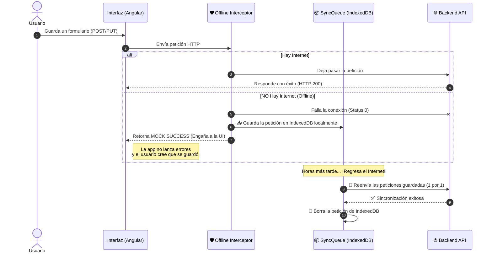

# 🚀 Arquitectura PWA Offline-First

Este documento explica de manera detallada, pero fácil de entender, cómo funciona el mecanismo **Offline-First** (modo sin conexión) en nuestra aplicación Angular.

---

## 🌟 ¿Cuál es el objetivo?

Cuando un usuario pierde su conexión a internet (en el campo, en un ascensor, o por falla del proveedor), **no queremos que la aplicación deje de funcionar**. 

El objetivo es:
1. Permitir al usuario **seguir navegando** (gracias al caché del Service Worker).
2. Permitir que el usuario siga enviando formularios y realizando acciones (como crear, editar o borrar registros).
3. **Guardar** esas acciones localmente de manera silenciosa.
4. **Sincronizar** los datos automáticamente con el servidor de manera invisible cuando el internet vuelva.

---

## 🗺️ Diagrama de Flujo del Sistema

---

## 🧩 Componentes Principales

La magia ocurre gracias a tres componentes clave que trabajan juntos:

### 1. 🌐 `connectivity.service.ts`
El vigilante de la red. Monitorea los eventos `online` y `offline` del navegador usando un **Signal** reactivo.
* **Cambio clave:** Antes nos redirigía obligatoriamente a una pantalla `/offline`. Ahora, permite al usuario quedarse donde está y seguir usando los formularios cacheados.

### 2. 🛡️ `offline.interceptor.fn.ts`
El escudo invisible. Intercepta **todas** las peticiones de modificación de datos (`POST`, `PUT`, `PATCH`, `DELETE`).
* Si el navegador está sin red, la petición fallará con un `Status 0`.
* El interceptor captura este fallo antes de que llegue al manejador de errores global.
* Envía la petición a encolar y devuelve a la aplicación una respuesta falsa (`MOCK`) de éxito (`status: 200`, `success: true`). ¡Así la pantalla no se llena de alertas de error rojas!

### 3. 📦 `sync-queue.service.ts`
La memoria a largo plazo. Utiliza la librería `localforage` para guardar las peticiones en la base de datos **IndexedDB** del dispositivo del usuario.
* IndexedDB persiste aunque el usuario cierre la pestaña o apague su computadora.
* Este servicio "escucha" al `connectivity.service.ts`. Cuando detecta que el internet volvió, saca las peticiones de IndexedDB y las dispara una por una de vuelta al Backend.

---

## 💡 Guía para Desarrolladores

Si vas a crear nuevas funciones en la plataforma, ten en cuenta estas reglas de oro:

> [!WARNING]
> **Generación de IDs Temporales (UUID)**
> Como las peticiones POST se guardarán offline, el Backend no nos devolverá un ID inmediatamente. 
> Cuando crees un objeto nuevo, el Frontend debe generar el ID (ej. usando `crypto.randomUUID()`) y mandarlo en el JSON al Backend. Así la UI podrá referenciar y usar ese ID localmente mientras la petición se sincroniza.

> [!TIP]
> **El Interceptor es selectivo**
> El `offline.interceptor` ignora las peticiones `GET`. Si no hay internet al pedir un listado (`GET`), seguirá dando error a menos que el `ngsw-config.json` de Angular (Service Worker) tenga esos datos en caché. Solo guarda acciones de mutación.

> [!NOTE]
> **Headers dinámicos de Autorización**
> Al encolar las peticiones, se eliminan intencionalmente los headers de Autorización antiguos. Cuando la `sync-queue` procesa y reenvía las peticiones, vuelven a pasar por el `jwt.interceptor`, lo que asegura que siempre usen el token más reciente, evitando errores `401 Unauthorized` si la sesión caducó mientras se estaba offline.

---
*Hecho con ❤️ para brindar la mejor experiencia en cualquier lugar, con o sin señal.*
