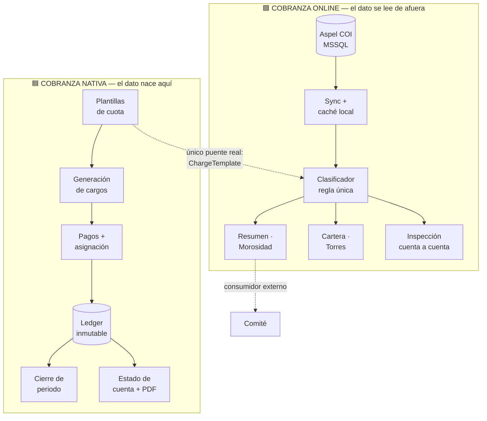

# Cobranza Nativa vs. Cobranza Online — Comparativa de Alcance y Estado de Madurez

> **Fecha:** 2026-08-11 · **Tipo:** Análisis comparativo + dictamen de madurez
> **Alcance auditado:** 286 archivos (`CobranzaNativa` back 160 + front 126 · `CobranzaOnline` back 25 + front 48)
> **Estado:** Vigente · **Deriva de:** [CONVENTIONS.md](../../../../../../../../CONVENTIONS.md)

| Rutas analizadas |
|---|
| `api/LuxuryApp.Application/Moduls/CobranzaLuxuryApp/CobranzaNativa/` |
| `api/LuxuryApp.Application/Moduls/CobranzaLuxuryApp/CobranzaOnline/` |
| `client/angular/src/app/apps/cobranza.luxuryapp/cobranza-nativa/` |
| `client/angular/src/app/apps/cobranza.luxuryapp/cobranza-online/` |

---

## 0 · Cómo leer este documento

| Símbolo | Significado |
|:--:|---|
| ✅ | Capacidad completa y **verificada en código** de punta a punta |
| 🟡 | Existe pero **parcial**, simulada o sin todas sus operaciones |
| 🟠 | Construida en backend pero **sin puerta de entrada** desde la UI |
| ❌ | No existe |
| ➖ | No aplica a la naturaleza de ese módulo |

> **Criterio de verificación usado:** una capacidad se marca ✅ solo si existe el endpoint backend **y** el frontend lo invoca realmente.
> Las referencias que aparecen únicamente en `cobranza-nativa-groups.const.ts` (catálogo documental del wrapper) **no cuentan como consumo**.
> Esta distinción cambió el resultado de 89 a **72 endpoints realmente consumidos**.

---

## 1 · Resumen ejecutivo

### 1.1 El veredicto en una línea

> **No son dos versiones del mismo módulo: son dos sistemas de naturaleza opuesta.**
> `CobranzaNativa` es un **subsistema financiero transaccional** — el dato nace, vive y se audita aquí.
> `CobranzaOnline` es una **capa de lectura sobre Aspel COI** — no es dueña del dato, lo consolida y clasifica.

### 1.2 Tablero de control

| Indicador | 🟦 Cobranza Nativa | 🟩 Cobranza Online |
|---|:--:|:--:|
| **Naturaleza** | Transaccional (escribe) | Analítica (lee) |
| **Fuente de verdad** | Sí | No — es Aspel COI |
| Endpoints backend | **104** | **18** |
| Subdominios (`Core/X`) | **17** | 0 (plano) |
| Servicios backend | 30 | 13 |
| Archivos que escriben en BD | 26 | 1 (caché) |
| Rutas frontend | 24 | 10 + 4 redirects |
| Componentes frontend | 126 archivos | 48 archivos |
| Specs frontend | 12 | 1 |
| **Dueño de tablas maestras** | No — ninguna de las 3 | No — ninguna de las 3 |
| Habilidades evaluadas ✅ | **40 / 70** | **19 / 70** |

### 1.3 Semáforo de madurez de Cobranza Nativa

```text
█████████████████░░░  17 de 24 rutas listas para producción  (71%)
███░░░░░░░░░░░░░░░░░   4 de 24 rutas parciales               (17%)
██░░░░░░░░░░░░░░░░░░   3 de 24 rutas bloqueadas              (12%)
```

**3 bloqueadores duros antes de producción** → ver [§6](#6--bloqueadores-antes-de-producción).

---

## 2 · Las dos naturalezas



### 2.1 La frontera real

- **Nativa no lee Aspel.** **Online no genera cargos ni aplica pagos.** No hay solapamiento funcional.
- **Único cruce detectado:** `cobranza-online/analysis` usa las **cuotas vigentes de `ChargeTemplate`** (entidad de Nativa) contra saldos Aspel.
- Online tiene un **consumidor externo declarado**: el módulo *Comité*, vía `ICobranzaOnlineDashboardAppService` e `IAspelCobranzaHausDetalleAppService`. Nativa **no tiene inventario de consumidores** equivalente.

---

## 3 · Ficha de alcance por módulo

### 3.1 🟦 CobranzaNativa

**Rol:** motor contable propio de LuxuryApp.

**Subdominios backend (17):**
`Approvals` · `Audit` · `Charges` · `ChargeTypes` · `CollectionCases` · `Fines` · `Invoices` · `LateFees` · `Ledger` · `Members` · `Metrics` · `Notifications` · `Payments` · `PeriodClosures` · `Reconciliation` · `Statements` · `Templates` — más `Contracts/ExternalCompatibility`.

**Distribución de endpoints:** 43 GET · 46 POST · 9 PUT · 6 DELETE, en 21 `MapGroup` bajo `api/cobranza/*`.

**Ciclo funcional que cubre:**

```text
Tipos de cargo → Plantillas de cuota (fija/indiviso) → Generación mensual
      ↓
Saldos iniciales → Cargos → Recargos por mora
      ↓
Pagos con asignación → Notas de crédito · Ajustes → Conciliación
      ↓
LEDGER INMUTABLE (+ verificación de integridad)
      ↓
Cierre / reapertura de periodo → Estado de cuenta + aging + PDF + email
      ↓
Multas reglamentarias → Casos de cobranza legal → Auditoría financiera
```

### 3.2 🟩 CobranzaOnline

**Rol:** ventana de consulta sobre la contabilidad Aspel COI del condominio.
Regla de clasificación única en `Services/CobranzaOnlineClasificador.cs`, gobernada por `docs/aspel/ASPEL_API_GUIDE.md`.

**Distribución de endpoints:** 14 GET · 3 POST (sync) · 1 PUT (exclusiones).

**Ciclo funcional que cubre:**

```text
Sync Aspel (completo / contabilidad / cobranza)
      ↓
Caché local con fallback declarado (dataSource="cache-local", isFallback=true)
      ↓
Clasificador (regla única)
      ↓
Resumen KPI · Análisis de cartera al corte · Detalle por condómino
Morosidad · Otros cargos · Movimientos · Adelantos · Torres
Exclusiones de cuentas · Listado base de inspección + histórico
```

---

## 4 · Tabla comparativa de habilidades

| Bloque | Contenido | Filas |
|---|---|:--:|
| [4.1](#41-entidades-maestras-propiedades-propietarios-y-habitantes) | **Entidades maestras** — propiedades, propietarios, habitantes | 1–11 |
| [4.2](#42-datos-y-ciclo-financiero) | Datos y ciclo financiero | 12–31 |
| [4.3](#43-control-trazabilidad-y-cierre) | Control, trazabilidad y cierre | 32–42 |
| [4.4](#44-salidas-reportes-e-integraciones) | Salidas, reportes e integraciones | 43–61 |
| [4.5](#45-arquitectura-y-calidad) | Arquitectura y calidad | 62–70 |

### 4.1 Entidades maestras: propiedades, propietarios y habitantes

> **Hallazgo principal de este bloque:** ni Cobranza Nativa ni Cobranza Online son dueños de la tabla de propiedades, de propietarios ni de habitantes. **Las tres viven fuera de `cobranza.luxuryapp`.**

#### 4.1.1 Quién es dueño de cada tabla maestra

| Tabla lógica | Entidad · Tabla física | Módulo dueño (backend) | Ruta pública | Pantalla (frontend) |
|---|---|---|---|---|
| **Propiedades** | `Property` · `Units` | `OperationsLuxuryApp/Property` | `api/properties` | `resident.luxuryapp/property/propiedades-list` |
| **Propietarios** | `Owner` | `OperationsLuxuryApp/Owner` | `api/owners` | `resident.luxuryapp/owner/owner-list` |
| **Habitantes / ocupantes** | `PropertyOccupant` · `UnitOccupants` | `OperationsLuxuryApp/PropertyOccupant` | `api/property-occupant` | `resident.luxuryapp/property/property-occupant-manager` |
| **Miembros de propiedad** *(modelo unificado)* | `PropertyMember` · `UnitMembers` | **`CobranzaNativa/Core/Members`** | `api/cobranza/property-members` | `cobranza-nativa/core/members` |

#### 4.1.2 Comparativa de habilidades sobre entidades maestras

| # | Habilidad | 🟦 Nativa | 🟩 Online | Nota |
|---:|---|:--:|:--:|---|
| 1 | **Tabla de propiedades (CRUD propio)** | ❌ | ❌ | Vive en `api/properties` (Operations / resident) |
| 2 | Consumir propiedades como catálogo | ✅ | 🟡 | Nativa vía `SelectItems.properties`; Online solo lee `Property.FullName` cuando la cuenta Aspel está vinculada |
| 3 | Importación masiva de propiedades | ❌ | ❌ | `POST api/properties/import/{customerId}` — fuera de ambos módulos |
| 4 | Usar el indiviso de la propiedad para cobrar | ✅ | 🟡 | Nativa calcula la cuota por `IndivisoPercentage`; Online solo lo lee para su análisis |
| 5 | **Tabla de propietarios (CRUD propio)** | ❌ | ❌ | Vive en `api/owners` (Operations / resident) |
| 6 | **Tabla de habitantes / ocupantes (CRUD propio)** | ❌ | ❌ | Vive en `api/property-occupant` (Operations / resident) |
| 7 | **Miembros de propiedad con rol y vigencia** | ✅ | ❌ | `MemberRole`: Propietario · Copropietario · Inquilino, con `StartDate`/`EndDate` |
| 8 | Responsable financiero único ante el ledger | ✅ | ❌ | `IsFinancialResponsible` en `PropertyMember` |
| 9 | Alta de miembro con creación de cuenta de usuario | ✅ | ❌ | `POST property-members/create-with-account` |
| 10 | Baja de membresía con fecha de término | ✅ | ❌ | `POST property-members/{id}/end-membership` |
| 11 | Migración de `Owner` + `Occupant` → `PropertyMember` | 🟠 | ➖ | Servicio completo, **sin UI** → ver [R6](#-r6--doble-modelo-de-personas-conviviendo) |

#### 4.1.3 Por qué la ruta `properties` de Nativa es un placeholder

```mermaid
flowchart LR
    subgraph OPS["🟨 OperationsLuxuryApp · resident.luxuryapp"]
        P[(Property<br/>Units)]
        O[(Owner)]
        OC[(PropertyOccupant<br/>UnitOccupants)]
    end

    subgraph NAT["🟦 CobranzaNativa"]
        PM[(PropertyMember<br/>UnitMembers)]
        CH[Cargos · Pagos<br/>Ledger]
    end

    subgraph ONL["🟩 CobranzaOnline"]
        AC[(CoiCobranzaAccount<br/>cuenta Aspel nivel 3)]
    end

    P -->|FK PropertyId| PM
    P -->|FK PropertyId| CH
    O -.->|migrate-from-legacy<br/>SIN UI| PM
    OC -.->|migrate-from-legacy<br/>SIN UI| PM
    P -.->|vínculo opcional<br/>"Fase 2"| AC
    PM --> CH
```

`CobranzaNativa` **depende** de la tabla de propiedades pero **no la administra**. Por eso la ruta `/cobranza-nativa/properties` es una tarjeta informativa: encapsula la dependencia para que el módulo no cargue pantallas de `resident.luxuryapp`, tal como declara su propio texto — *"Fase 1 en ejecución"*.

Lo que Nativa **sí** aporta es `PropertyMember`: un modelo unificado de persona↔propiedad con rol, vigencia y responsable financiero, que existe precisamente para **sustituir** a `Owner` + `PropertyOccupant`.

`CobranzaOnline` no participa de ninguna de las cuatro tablas: su unidad de análisis es la **cuenta contable Aspel de nivel 3**, no la propiedad. Solo toca `Property` para dos cosas: mostrar `FullName` cuando la cuenta está vinculada, y contar propiedades como *fallback* si no puede determinar el total de condóminos desde los saldos Aspel.

### 4.2 Datos y ciclo financiero

| # | Habilidad | 🟦 Nativa | 🟩 Online | Nota |
|---:|---|:--:|:--:|---|
| 12 | Es fuente de verdad del dato | ✅ | ❌ | Online lee Aspel |
| 13 | Sincronización con Aspel COI | ❌ | ✅ | 3 endpoints: `completo`/`contabilidad`/`cobranza` |
| 14 | Caché local con fallback declarado | ❌ | ✅ | `dataSource` / `isFallback` visibles en UI |
| 15 | Catálogo de tipos de cargo (CRUD) | ✅ | ➖ | |
| 16 | Plantillas de cuota (fija / indiviso) | ✅ | 🟡 | Online las **lee** para su análisis |
| 17 | Matriz de cobertura de cuotas | ✅ | ❌ | Detecta propiedades sin cuota |
| 18 | Generación mensual de cargos | ✅ | ❌ | `POST charges/generate-monthly` |
| 19 | Carga masiva de cargos (CSV) | ✅ | ❌ | |
| 20 | Saldos iniciales masivos | ✅ | ❌ | |
| 21 | Registro de pagos | ✅ | ❌ | |
| 22 | Asignación de pago a cargos | ✅ | ❌ | `PaymentAllocationService` |
| 23 | Auto-aplicación de saldos a favor | ✅ | ❌ | `auto-apply-all`, `auto-apply-overpayments` |
| 24 | Cancelación de pago con reversa | ✅ | ❌ | |
| 25 | Notas de crédito | 🟡 | ❌ | **Entran como pago, no como ajuste** → [§5.3](#53--riesgos-funcionales-detectados) |
| 26 | Ajustes financieros | 🟠 | ❌ | Servicio completo, **sin UI** |
| 27 | Políticas de mora + cálculo | ✅ | ❌ | `calculate-late-fees`, `preview` |
| 28 | Multas reglamentarias + artículos | 🟡 | ❌ | Falta subir evidencias desde UI |
| 29 | Casos de cobranza legal | 🟠 | ❌ | No se puede **crear** un caso desde UI |
| 30 | Escalación automática de morosos | ✅ | ❌ | `evaluate-and-escalate` |
| 31 | Exclusión de cuentas del reporte | ❌ | ✅ | `PUT excluded-accounts` |

### 4.3 Control, trazabilidad y cierre

| # | Habilidad | 🟦 Nativa | 🟩 Online | Nota |
|---:|---|:--:|:--:|---|
| 32 | Ledger inmutable por evento | ✅ | ➖ | Cableado en 8 servicios |
| 33 | Verificación de integridad del ledger | 🟠 | ➖ | Servicio listo, **sin UI** |
| 34 | Cierre / reapertura de periodo | ✅ | ➖ | |
| 35 | **Bloqueo efectivo del periodo cerrado** | ✅ | ➖ | `LedgerService` consulta `IPeriodClosureService` — validación en el punto correcto |
| 36 | Maker-checker (aprobaciones) | 🟠 | ❌ | **Inerte**: ningún servicio genera solicitudes |
| 37 | Bitácora de auditoría financiera | 🟡 | ❌ | Solo escribe integridad y notificaciones |
| 38 | Auditoría de sincronización | ➖ | ✅ | `CobranzaOnlineSyncAudit` |
| 39 | Conciliación de pagos | ✅ | ❌ | |
| 40 | Idempotencia en comandos sensibles | ✅ | ➖ | Declarada en reglas de negocio |
| 41 | **Autorización por política de rol** | 🔴 | ✅ | 20 de 21 grupos sin política → [§7.1](#71--hallazgos-críticos) |
| 42 | Aislamiento multi-tenant (`CustomerId`) | ✅ | ✅ | Online vía `CobranzaOnlineCustomerScope` |

### 4.4 Salidas, reportes e integraciones

| # | Habilidad | 🟦 Nativa | 🟩 Online | Nota |
|---:|---|:--:|:--:|---|
| 43 | Estado de cuenta / kardex | ✅ | ✅ | Nativa por ledger; Online por auxiliares Aspel |
| 44 | Aging (antigüedad de saldos) | ✅ | ✅ | |
| 45 | Exportación PDF | ✅ | ❌ | `NativeStatementPdfExportService` |
| 46 | Exportación Excel / CSV | 🟡 | ❌ | Nativa solo **plantillas** CSV de importación |
| 47 | Envío de estado de cuenta por email | ✅ | ❌ | Individual y por lote |
| 48 | Envío de recibo de pago por email | 🟠 | ❌ | Endpoint listo, **sin botón** |
| 49 | Configuración de notificaciones | ✅ | ❌ | |
| 50 | Configuración de facturación | ✅ | ❌ | Modal desde el wrapper |
| 51 | Tiempo real (SignalR) | ✅ | ❌ | Cableado en 5 servicios + 2 pantallas |
| 52 | Facturación CFDI | 🔴 | ❌ | **Simulada** — UUID y XML/PDF mock, sin PAC |
| 53 | Webhooks de pasarela | ✅ | ❌ | Público con validación de firma |
| 54 | Dashboard KPI | ✅ | ✅ | |
| 55 | Top deudores / tendencia mensual | ✅ | ✅ | |
| 56 | Gráficas en UI | ❌ | ✅ | `app-pie-chart`, `app-chart-wrapper` |
| 57 | Resumen por torre / bloque | ❌ | ✅ | |
| 58 | Adelantos y saldos a favor (reporte) | 🟡 | ✅ | Nativa los aplica, no los reporta agregado |
| 59 | Reporte financiero por rango de meses | ❌ | ✅ | |
| 60 | Inspección de listado base + histórico | ❌ | ✅ | Trazabilidad cuenta por cuenta |
| 61 | Onboarding visual del módulo | ✅ | ❌ | `system-overview`, `flow-map` |

### 4.5 Arquitectura y calidad

| # | Habilidad | 🟦 Nativa | 🟩 Online | Nota |
|---:|---|:--:|:--:|---|
| 62 | Minimal API `IEndPointsModule` | ✅ | ✅ | Ambos migrados |
| 63 | Organización por subdominio | ✅ | ❌ | Online es plano |
| 64 | Contratos dentro del módulo | ✅ | ❌ | Online los tiene en `LuxuryApp.Shared` |
| 65 | Estado compartido en frontend | ❌ | ✅ | Online: `store` + `filterState` |
| 66 | Filtro de periodo unificado | ❌ | ✅ | Nativa lo repite pantalla por pantalla |
| 67 | Vista mobile dedicada | 🟡 | 🟡 | Ambos vía `app-data-view-mobile`, sin `desktop/`+`mobile/` |
| 68 | Pruebas unitarias frontend | 🟡 | ❌ | 12 specs vs 1 |
| 69 | Logging estructurado | ✅ | ✅ | 30 vs 10 archivos con `ILogger` |
| 70 | Validadores backend (FluentValidation) | ❌ | ❌ | Ninguno en ambos |

---

## 5 · ¿Qué está listo para usarse en Cobranza Nativa?

### 5.1 Semáforo ruta por ruta (24 rutas)

| # | Ruta | Estado | Qué funciona hoy |
|---:|---|:--:|---|
| 1 | `/` (wrapper) | ✅ Listo | Hub navegable con 6 grupos y catálogo de capacidades |
| 2 | `dashboard` | ✅ Listo | KPIs, top deudores, tendencia mensual, SignalR |
| 3 | `charge-types` | ✅ Listo | CRUD completo |
| 4 | `charge-templates` | ✅ Listo | CRUD + preview de cálculo |
| 5 | `charge-template-coverage` | ✅ Listo | Matriz de cuotas vigentes por propiedad |
| 6 | `charges` | ✅ Listo | CRUD + cancelar + importación masiva + SignalR |
| 7 | `initial-balance` | ✅ Listo | Consulta de estado + guardado masivo |
| 8 | `payments` | ✅ Listo | Registro, aplicación a cargos, cancelación, historial |
| 9 | `late-fee-policies` | ✅ Listo | CRUD completo |
| 10 | `estado-cuenta` | ✅ Listo | Consulta + aging + PDF + envío email individual y por lote |
| 11 | `members` | ✅ Listo | CRUD + alta con cuenta + baja de membresía |
| 12 | `regulation-articles` | ✅ Listo | CRUD completo |
| 13 | `ledger` | ✅ Listo | Consulta de movimientos por propiedad con filtros |
| 14 | `period-closures` | ✅ Listo | Cerrar / reabrir, con bloqueo efectivo en el ledger |
| 15 | `reconciliation` | ✅ Listo | Pagos sin aplicar + auto-aplicación |
| 16 | `system-overview` | ✅ Listo | Documental |
| 17 | `flow-map` | ✅ Listo | Documental |
| 18 | `automated-services` | 🟡 Parcial | 4 jobs disparables **a mano**; sin scheduler (no hay Hangfire ni `BackgroundService`) |
| 19 | `audit` | 🟡 Parcial | Visor funcional, pero **la bitácora casi no se escribe** |
| 20 | `property-fines` | 🟡 Parcial | Crear, anular y emitir cargo OK; **no se pueden subir evidencias** desde la UI |
| 21 | `collection-cases` | 🟡 Parcial | Solo lectura + escalado automático + bitácora; **no se puede crear ni editar un caso** |
| 22 | `approvals` | 🟠 Inerte | Bandeja funcional, pero **nada genera solicitudes** |
| 23 | `invoices` | 🔴 Bloqueado | CFDI **simulado**; los botones XML/PDF **no tienen handler** |
| 24 | `properties` | 🔴 Bloqueado | Es un **placeholder** informativo. La tabla de propiedades no pertenece a este módulo → ver [§4.1](#41-entidades-maestras-propiedades-propietarios-y-habitantes) |

### 5.2 Capacidades construidas en backend pero sin puerta de entrada

Endpoints que existen, compilan y funcionan — pero ninguna pantalla los llama:

| Endpoint | Capacidad perdida | Impacto |
|---|---|:--:|
| `POST cobranza/adjustments` | Ajuste financiero sobre un cargo | 🔴 Alto |
| `POST cobranza/adjustments/credit-notes` | Emitir nota de crédito formal | 🔴 Alto |
| `POST cobranza/adjustments/credit-notes/{id}/cancel` | Cancelar nota de crédito | 🟠 Medio |
| `POST cobranza/approvals` | Crear solicitud de aprobación | 🔴 Alto |
| `POST cobranza/approvals/{id}/cancel` | Cancelar solicitud | 🟠 Medio |
| `GET cobranza/approvals/property/{id}/customer/{id}` | Aprobaciones por propiedad | 🟡 Bajo |
| `POST cobranza/collection-cases` | Crear caso de cobranza legal | 🔴 Alto |
| `PUT cobranza/collection-cases/{id}` | Editar caso | 🟠 Medio |
| `POST cobranza/property-fines/{id}/evidences` | Adjuntar evidencia a multa | 🟠 Medio |
| `DELETE cobranza/property-fines/evidences/{id}` | Eliminar evidencia | 🟡 Bajo |
| `POST cobranza/invoices` · `POST .../{id}/cancel` | Generar / cancelar CFDI | 🔴 Alto |
| `POST cobranza/notifications/receipts/{id}/send` | Enviar recibo de pago | 🟠 Medio |
| `POST cobranza/ledger/integrity/customer/{id}` | Verificar integridad del ledger | 🟠 Medio |
| `GET cobranza/ledger/charge/{id}/balance` · `batch/{id}` | Trazabilidad fina del ledger | 🟡 Bajo |
| `POST cobranza/property-members/migrate-from-legacy/...` | Migrar `Owner` + `PropertyOccupant` → `PropertyMember` | 🔴 Alto — ver [R6](#-r6--doble-modelo-de-personas-conviviendo) |

> **Lectura:** ~15 endpoints con lógica de negocio real quedaron sin conexión a la UI.
> No es deuda de backend: es **deuda de cableado frontend**, mucho más barata de cerrar.

### 5.3 · Riesgos funcionales detectados

#### 🔴 R1 — La "nota de crédito" no es una nota de crédito

`core/payments/credit-note-modal.ts` envía a `Endpoints.CobranzaCore.Payments.create` con
`method: EPaymentMethod.DebtForgiveness`. Es decir: **una condonación se registra como un pago**.

Consecuencias verificadas:

- No pasa por `AdjustmentService`, que sí valida `AuthorizedBy` obligatorio para condonaciones e impide importes negativos.
- `DebtForgiveness` no tiene ningún tratamiento especial en backend — es un valor más del enum `PaymentMethod`.
- La condonación **infla el total recaudado** en métricas y conciliación, porque contablemente es un pago.

#### 🔴 R2 — El maker-checker está inerte

`FinancialApprovalService` es el único lugar que instancia `FinancialApprovalRequest`, y **ningún servicio de negocio lo inyecta**. La bandeja de aprobaciones solo mostraría solicitudes creadas por llamada directa al endpoint público, que ninguna pantalla emite.

En la práctica: **hoy no existe control de segunda firma** sobre ninguna operación financiera.

#### 🟠 R3 — La bitácora de auditoría casi no se escribe

`IFinancialAuditService` solo se inyecta en `LedgerIntegrityService` y `CobranzaNativaNotificationService`. Los flujos que más importan auditar — pagos, cargos, cancelaciones, ajustes — **no registran nada**.

#### 🟠 R4 — La automatización no está automatizada

`automated-services` dispara 4 jobs (generar cargos, calcular recargos, escalar morosos, auto-conciliar) pero **solo a mano**. No existe Hangfire, `IHostedService` ni `BackgroundService` en el módulo. La propia pantalla admite el estado de los webhooks: *"Infraestructura lista, pendiente de activar"*.

#### 🟡 R5 — El ledger tiene el bloqueo en el lugar correcto (nota positiva)

`LedgerService` consulta `IPeriodClosureService` antes de escribir. Cualquier operación que intente tocar un periodo cerrado queda bloqueada en la capa correcta, sin depender de que cada servicio lo recuerde. **Esto es un acierto de diseño y debe preservarse.**

#### 🔴 R6 — Doble modelo de personas conviviendo

`CobranzaNativa` creó `PropertyMember` (`UnitMembers`) como **modelo unificado** para sustituir a `Owner` y `PropertyOccupant`. La prueba es `PropertyMemberService.MigrateFromLegacyAsync`, que lee ambas tablas legacy y mapea `OccupantType` → `MemberRole`:

| Origen (`OccupantType`) | Destino (`MemberRole`) |
|---|---|
| `PropietarioHabitante` | `Owner` (Propietario) |
| `Inquilino` · `Familiar` · `Roomie` · `AdministradorRenta` · `PersonalServicio` · `Otro` | `Tenant` (Inquilino) |

El problema es que **la sustitución nunca se consumó**:

- El endpoint `POST cobranza/property-members/migrate-from-legacy/customer/{id}` **no lo invoca ninguna pantalla**.
- `api/owners` y `api/property-occupant` **siguen vivos con CRUD completo** y sus pantallas activas en `resident.luxuryapp`.
- Por lo tanto, hoy **la misma persona puede existir dos veces** con datos distintos: como `Owner`/`PropertyOccupant` en Operations y como `PropertyMember` en Cobranza.

**Consecuencia financiera concreta:** `IsFinancialResponsible` —quién responde ante el ledger— solo existe en `PropertyMember`. Si un condominio no ejecutó la migración, **el responsable financiero de sus propiedades está sin definir**, y con él los avisos de cobro y la imputación de cargos.

**Decisión pendiente que el módulo no puede tomar solo:** o se ejecuta la migración y se congelan las tablas legacy, o se declara formalmente que `PropertyMember` es solo una capa financiera sobre ellas. Hoy no está declarado ninguno de los dos.

---

## 6 · Bloqueadores antes de producción

| # | Bloqueador | Por qué bloquea | Esfuerzo |
|:--:|---|---|:--:|
| **B1** | Autorización sin política de rol en 20 de 21 grupos | Cualquier usuario autenticado puede cerrar periodos, aprobar operaciones o registrar pagos | Bajo |
| **B2** | Ruta física de disco expuesta al frontend en evidencias de multas | Fuga de estructura del servidor; viola Regla Crítica 9 | Bajo |
| **B3** | CFDI simulado presentado como funcional | Un usuario puede creer que facturó; genera UUID falso y PDF mock | Medio |
| **B4** | Doble modelo de personas sin migración ejecutada | Si un condominio no migró, sus propiedades **no tienen responsable financiero definido** ([R6](#-r6--doble-modelo-de-personas-conviviendo)) | Medio |

> **B1 y B2 son de bajo esfuerzo y alto riesgo.** Se cierran antes que cualquier funcionalidad nueva.
> **B4 no es técnico, es una decisión de arquitectura** que Cobranza Nativa no puede tomar sola: involucra a `OperationsLuxuryApp` y `resident.luxuryapp`.

---

## 7 · Cumplimiento de CONVENTIONS.md

### 7.1 · Hallazgos críticos

#### 🔴 C1 — Nativa: autorización sin política de rol

De 21 `MapGroup`, **20 usan `.RequireAuthorization()` sin política**. Solo `Reconciliation` exige `"Finanzas"`.
Online, en contraste, aplica `"Finanzas"` en todos sus grupos y `"SoloSuperUsuario"` en el sync.

Endpoints expuestos a cualquier usuario autenticado:

```text
POST api/cobranza/payments
POST api/cobranza/period-closures/customer/{id}/close
POST api/cobranza/approvals/{id}/approve
POST api/cobranza/charges/generate-monthly
```

#### 🔴 C2 — Nativa: ruta física expuesta al frontend

| Capa | Evidencia |
|---|---|
| Servicio | `Core/Fines/Services/PropertyFineAppService.cs:242` → `StoragePath = fullPath` |
| DTO | `Core/Fines/DTOs/FineEvidenceResponseDTO.cs:8` → devuelve `StoragePath` |
| Frontend | `interfaces/property-fine.dto.ts:30` → recibe `storagePath` |

No existe **ni un solo uso** de `IFileReadPathService` en todo el módulo. Tampoco se usa `WebButtonIconViewPdf`.

#### 🔴 C3 — Nativa: regla "1 archivo = 1 DTO" violada en 8 archivos

DTOs embebidos dentro de archivos de interfaz:

| Archivo | DTOs embebidos |
|---|:--:|
| `Core/Members/Interfaces/IPropertyMemberService.cs` | **6** |
| `Core/Templates/Interfaces/IChargeTemplateAppService.cs` | 2 |
| `Core/Ledger/Interfaces/ILedgerIntegrityService.cs` | 2 |
| `Core/Approvals/Interfaces/IFinancialApprovalService.cs` | 2 |
| `Core/Ledger/Interfaces/ILedgerService.cs` | 1 |
| `Core/PeriodClosures/Interfaces/IPeriodClosureService.cs` | 1 |
| `Core/Audit/Interfaces/IFinancialAuditService.cs` | 1 |
| `Core/Approvals/EndPoints/AdjustmentsEndPoints.cs` | 1 |

Online tiene 1 caso análogo (`Services/CobranzaOnlineTypes.cs`, 4 records — tipos internos, no DTOs de transporte).

#### 🔴 C4 — Online: PrimeNG directo fuera de la excepción `p-table`

| Archivo | Import prohibido |
|---|---|
| `cobranza-date-picker-modal.ts:3` | `primeng/dynamicdialog` |
| `morosidad/cobranza-online-morosidad-detail-modal.ts:10` | `primeng/dynamicdialog` |
| `detalle-condominos/cobranza-online-detalle-condominos.ts:18` | `primeng/selectbutton` |

Nativa: **cero** imports directos de PrimeNG. Punto a su favor.

#### 🔴 C5 — Ambos: tokens CSS (Regla Crítica 8)

| Métrica | 🟦 Nativa | 🟩 Online |
|---|:--:|:--:|
| Hex hardcodeados | 99 | 11 |
| `style=""` inline | **0** | **25** |
| Utility classes PrimeFlex | Intensivo (`flex` ×388, `text-500` ×112) | Intensivo (`flex` ×181) |

Concentración en Nativa: `cobranza-nativa-groups.const.ts` (23), `system-flow-map.scss` (22), wrapper (31).

#### 🔴 C6 — Online: contratos en `LuxuryApp.Shared`

33 DTOs en `LuxuryApp.Shared/DTOs/CobranzaOnline/` y 9 interfaces en `LuxuryApp.Shared/Services/CobranzaOnline/`, mientras las carpetas `DTOs/`, `Interfaces/` y `Docs/` **del propio módulo están vacías**.

Consecuencia operativa: todo cambio de contrato de Online es un cambio en shared y exige análisis de impacto formal (§6.1).

### 7.2 · Cumplimiento comparado

| Regla | 🟦 Nativa | 🟩 Online |
|---|:--:|:--:|
| Endpoints centralizados (§6.3) | ✅ 0 strings hardcodeados | ✅ 0 strings hardcodeados |
| `ApiResponseService`, nunca `HttpClient` | ✅ 48/48 archivos | ✅ 7/7 archivos |
| Carpeta `interfaces/`, nunca `models/` | ✅ + sufijo `.dto.ts` | 🟡 carpeta OK, 7 archivos `.model.ts` |
| Iconos vía `app-icon` (§6.1) | ✅ 120 usos | ✅ 26 usos |
| SELECTs centralizados (Regla Crítica 6) | ✅ usa `enum-select.service` | ✅ sin SELECTs locales |
| PrimeNG solo `p-table` (§5.5) | ✅ | 🔴 3 archivos |
| Carpetas no previstas | 🟡 avaladas por su doc §5.10 | 🔴 `helpers/`, `state/` sin aval |
| Archivos ajenos en `src/` | ✅ limpio | 🔴 `check.ps1`, `image.png`, `*.bak.html`, 2 `.md` sueltos, y `5. AVIVIA 58, COB 25.xlsx` en backend |
| Validadores backend | ❌ ninguno | ❌ ninguno |
| README rector de módulo | 🔴 ausente (7 docs sin índice) | ✅ completo |
| Registro en `CONVENTIONS.md §5.10` | ✅ | 🔴 ausente |

### 7.3 · Documentación desincronizada

| Documento | Desincronía verificada |
|---|---|
| `docs/conventions/modules/cobranza-nativa-module-conventions.md` §5 | Declara rutas públicas `api/accounting-coi/native-collection/*`. **La realidad es `api/cobranza/*`.** |
| Mismo documento, §"Referencias" | Referencia `COBRANZA-NATIVA-DOCUMENTACION-MAESTRA-2026-07-03.md` como *"no localizado"* — pero **sí existe** en esta misma carpeta |
| `CobranzaOnline/README.md` tabla de endpoints | Lista un `POST /sync` (#9) que **no existe** en el código |
| Mismo README, endpoint #1 | Ruta sin el segmento `customer/`; la real es `dashboard/customer/{customerId}/year/{year}/month/{month}` |

---

## 8 · Plan de remediación priorizado

### Fase 1 — Seguridad y cumplimiento crítico

| # | Acción | Archivos | Impacto |
|:--:|---|---|:--:|
| 1.1 | Aplicar política de rol en los 20 `MapGroup` de Nativa | 20 `*EndPoints.cs` | 🔴 Crítico |
| 1.2 | Sustituir `StoragePath` físico por URL segura vía `IFileReadPathService` | `PropertyFineAppService.cs`, `FineEvidenceResponseDTO.cs`, `property-fine.dto.ts` | 🔴 Crítico |
| 1.3 | Marcar la pantalla de facturas como **simulada** hasta integrar PAC, o retirarla del menú | `invoice-list.*`, `InvoiceService.cs` | 🔴 Crítico |

### Fase 2 — Integridad financiera

| # | Acción | Impacto |
|:--:|---|:--:|
| 2.1 | Redirigir el modal de nota de crédito a `Adjustments.createCreditNote` (deja de ser un pago) | 🔴 Alto |
| 2.2 | Invocar `IFinancialApprovalService` desde ajustes, condonaciones y cancelaciones — activar el maker-checker | 🔴 Alto |
| 2.3 | Inyectar `IFinancialAuditService` en pagos, cargos y cancelaciones | 🟠 Medio |
| 2.4 | **Decidir el destino del modelo de personas**: ejecutar `migrate-from-legacy` y congelar `Owner`/`PropertyOccupant`, o declarar `PropertyMember` como capa financiera sobre ellas | 🔴 Alto |
| 2.5 | Exponer la migración en UI (o ejecutarla como tarea de despliegue) según lo decidido en 2.4 | 🟠 Medio |

### Fase 3 — Cableado de capacidades huérfanas

| # | Acción | Impacto |
|:--:|---|:--:|
| 3.1 | UI para crear y editar casos de cobranza legal | 🔴 Alto |
| 3.2 | UI de ajustes financieros | 🔴 Alto |
| 3.3 | Carga y borrado de evidencias en multas | 🟠 Medio |
| 3.4 | Botón de envío de recibo de pago | 🟠 Medio |
| 3.5 | Botón de verificación de integridad del ledger | 🟠 Medio |
| 3.6 | Resolver la ruta `properties` (feature propia o adaptador formal) | 🟠 Medio |

### Fase 4 — Convenciones y gobernanza

| # | Acción | Módulo |
|:--:|---|:--:|
| 4.1 | Extraer los 16 DTOs embebidos en archivos de interfaz | 🟦 Nativa |
| 4.2 | Sustituir imports directos de PrimeNG por el catálogo `shared/ui` | 🟩 Online |
| 4.3 | Migrar hex y `style=""` a tokens `var(--ds-*)` | Ambos |
| 4.4 | Eliminar `check.ps1`, `image.png`, `*.bak.html` y el `.xlsx` del árbol de código | 🟩 Online |
| 4.5 | Crear `README.md` rector en el backend de Nativa | 🟦 Nativa |
| 4.6 | Registrar `CobranzaOnline` en `CONVENTIONS.md §5.10` con su doc de convenciones | 🟩 Online |
| 4.7 | Corregir las 4 desincronías documentales de [§7.3](#73--documentación-desincronizada) | Ambos |

### Fase 5 — Automatización y calidad

| # | Acción | Módulo |
|:--:|---|:--:|
| 5.1 | Scheduler real para los 4 jobs (hoy manuales) | 🟦 Nativa |
| 5.2 | Filtro de periodo unificado y store compartido, tomando Online como referencia | 🟦 Nativa |
| 5.3 | Elevar cobertura de specs (12 y 1 son insuficientes) | Ambos |

---

## 9 · Conclusión

**Cobranza Nativa está sustancialmente construida.** 17 de 24 rutas funcionan de punta a punta, el ledger está correctamente cableado en 8 servicios, y el bloqueo de periodos cerrados está en el lugar arquitectónicamente correcto — dentro de `LedgerService`, no repartido por cada servicio.

Los cuatro problemas de fondo no son de volumen de código, son de **cierre**:

1. **Seguridad sin terminar** — la autorización quedó genérica en casi todo el módulo.
2. **Controles construidos pero desconectados** — maker-checker, auditoría, ajustes y notas de crédito existen en backend y no se ejercen.
3. **Una pantalla que promete lo que no cumple** — la facturación CFDI.
4. **Una migración de modelo a medio camino** — `PropertyMember` nació para sustituir a `Owner` y `PropertyOccupant`, pero las tres tablas conviven y la migración nunca se ejecutó desde ninguna UI.

Sobre las **entidades maestras**, el hallazgo es estructural y conviene no perderlo de vista: **ninguno de los dos módulos es dueño de la tabla de propiedades, de propietarios ni de habitantes.** Viven en `OperationsLuxuryApp` con interfaz en `resident.luxuryapp`. Cobranza Nativa aporta un cuarto modelo —`PropertyMember`— que es el único lugar donde existe el concepto de **responsable financiero ante el ledger**; Cobranza Online no participa de ninguna de las cuatro, porque su unidad de análisis es la cuenta contable Aspel, no la propiedad.

**Cobranza Online es más pequeño, más maduro en gobernanza y menos ambicioso**, lo cual es coherente con su naturaleza de capa de lectura. Sus debilidades son de convención (PrimeNG directo, contratos en shared, basura en el árbol), no de integridad financiera — porque no maneja integridad financiera.

**Los dos módulos son complementarios, no redundantes.** Las capacidades de reporte de Online — torres, reporte financiero por rango, inspección con histórico, gráficas — **no existen en Nativa**; el ciclo transaccional de Nativa no existe en Online. La convergencia natural sería que Nativa alimente los reportes de Online cuando un condominio deje Aspel. Hoy ese puente es únicamente `ChargeTemplate`.

---

## Anexo A · Método de verificación

| Verificación | Comando / criterio |
|---|---|
| Conteo de endpoints | `grep -rhoE "\.Map(Get\|Post\|Put\|Delete\|Patch)\(" --include=*.cs` |
| Políticas de autorización | `grep -rnE "MapGroup\(\|RequireAuthorization\(" --include=*.cs` |
| Consumo real de endpoints | `grep -rhoE "Endpoints\.CobranzaCore\.[A-Za-z0-9_]+\.[A-Za-z0-9_]+"` **excluyendo** `cobranza-nativa-groups.const.ts` y `*.spec.ts` |
| Cableado de servicios | `grep -rln "I<Servicio>" --include=*.cs` sobre el módulo completo |
| Escrituras a BD | `grep -rl "SaveChangesAsync"` |
| DTOs por archivo | conteo de `^public (sealed )?(record\|class\|enum\|interface)` por archivo |
| Tokens vs hardcoding | `grep -rcoE "#[0-9a-fA-F]{3,8}\b"` sobre `.html`, `.scss`, `.ts` |
| Comportamiento de edición | lectura de `FormHelper.submitCrud` — construye `PUT {endpoint}/{id}` cuando hay `id`, por eso la ausencia de la clave `.update` **no** implica falta de edición |

## Anexo B · Referencias

- [CONVENTIONS.md](../../../../../../../../CONVENTIONS.md) — fuente única de reglas
- [cobranza-nativa-module-conventions.md](../../../../../../../../docs/conventions/modules/cobranza-nativa-module-conventions.md) — guía rectora del módulo *(con desincronías, ver §7.3)*
- [CobranzaOnline/README.md](../../../../../../../../api/LuxuryApp.Application/Moduls/CobranzaLuxuryApp/CobranzaOnline/README.md) — arquitectura de Online *(con desincronías, ver §7.3)*
- [ASPEL_API_GUIDE.md](../../../../../../../../docs/aspel/ASPEL_API_GUIDE.md) — reglas de clasificación de Online
- [reglas-negocio-cobranza-nativa.md](../../../../../../../../api/LuxuryApp.Application/Moduls/CobranzaLuxuryApp/CobranzaNativa/Docs/reglas-negocio-cobranza-nativa.md)
- [ORGANIZACION-FRONTAL-CNATIVA-2026-07-26.md](./ORGANIZACION-FRONTAL-CNATIVA-2026-07-26.md)
- [02-matriz-operativa-front-cobranza-nativa.md](./02-matriz-operativa-front-cobranza-nativa.md)
