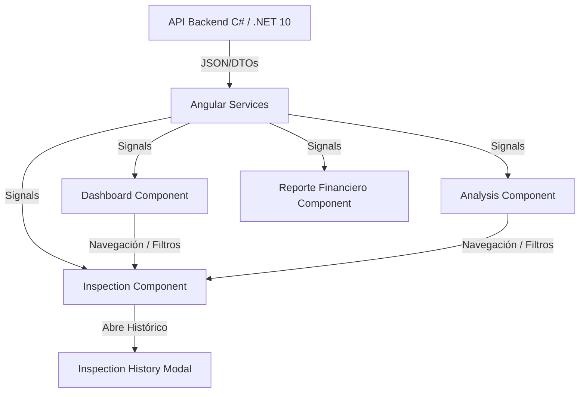

📍 Ruta: 📂 Documentación > 💼 Contabilidad > 💰 Cobranza Online

📅 Última Revisión: Junio 2026
🛡️ Estado: Vigente
👤 Responsable: Antigravity

# 📊 Análisis de Módulo: Cobranza Online (Frontend)

Este documento contiene un análisis punta a punta del módulo de Cobranza Online en el frontend de Angular (`client/angular/src/app/features/accounting/general-ledger/contabilidad/cobranza-online`). A pesar de la regla de ubicaciones de documentos, este reporte se ha generado temporalmente en el backend bajo solicitud expresa del usuario.

---

## 1. 🎯 Resumen Ejecutivo

El módulo de **Cobranza Online** proporciona herramientas de visualización, análisis y gestión financiera. Está diseñado en Angular utilizando Signals y un fuerte tipado basado en interfaces TypeScript en la carpeta `models`. Las vistas principales abarcan desde un panel general (Dashboard) hasta la inspección detallada de movimientos, análisis de morosidad y reportes financieros complejos.

### Criterios de Éxito ✅
- Comprender la estructura de páginas del módulo.
- Identificar los modelos de datos que alimentan cada sección.
- Visualizar el flujo de interacción entre las entidades principales.

---

## 2. 🧩 Estructura de Componentes y Páginas

El directorio está organizado en dos bloques principales: `models` (interfaces de datos) y `pages` (vistas).

### 📂 Modelos (`models/`)
Las interfaces definen el contrato estricto de datos, consumido desde la API del backend:
- `cobranza-online-dashboard.model.ts`: KPIs, resúmenes, top morosos, desglose por departamentos y cargos corrientes.
- `cobranza-online-analysis.model.ts`: Métricas de estado de cobranza (perfecta, morosos, deuda corriente, judicial, anticipos, etc.).
- `cobranza-online-inspection.model.ts`: Inspección detallada de movimientos contables y pólizas a nivel departamento/cuenta.
- `cobranza-online-reporte-financiero.model.ts`: Estado de resultados y fondos de mejoras organizados por meses (Ingresos vs Gastos).
- `cobranza-online-sync.model.ts`: Metadatos de sincronización de la información.
- `cobranza-online-exclusions.model.ts` y `presupuesto-contabilidad.model.ts`: Estructuras para gestión de exclusiones y presupuestos.

### 📄 Páginas (`pages/`)
1. **Dashboard** (`dashboard/`): Panel principal con métricas clave (KPIs), gráficas y resúmenes de deuda y cobranza.
2. **Analysis** (`analysis/`): Vista orientada a la clasificación de la cartera (cobranza judicial, morosos, corriente, sin adeudo, anticipos).
3. **Inspection** (`inspection/`): Incluye una vista en tabla para explorar las transacciones, junto a un componente modal (`cobranza-online-inspection-history-modal`) para revisar el histórico a fondo.
4. **Reporte Financiero** (`reporte-financiero/`): Matriz financiera comparativa por meses que cruza ingresos y gastos, determinando subtotales, resultados de periodo y fondo de mejoras.
5. **Exclusions** (`exclusions/`): Interfaz para establecer reglas u omitir ciertas cuentas del flujo normal de cobranza.
6. **Presupuesto Contabilidad** (`presupuesto-contabilidad/`): Gestión y seguimiento del presupuesto base del ejercicio contable frente a lo real.

---

## 3. 📊 Arquitectura y Flujo de Datos

---

## 4. ⚖️ Funcionalidades Clave (Showcase)

| Funcionalidad | Antes (Limitación) | Después (Solución) |
| :--- | :--- | :--- |
| **Análisis de Morosidad** | Reportes estáticos y difíciles de cruzar. | Vista dinámica clasificada por nivel de morosidad (Judicial, Morosos, Corriente). |
| **Inspección de Pólizas** | Navegar entre múltiples pantallas para ver el detalle. | Modal embebido de historial (`inspection-history-modal`) y desglose rápido a nivel 401. |
| **Reporte Financiero** | Carga lenta y cálculo manual de remanentes. | Renderizado reactivo por meses y cálculo automático del remanente rolling usando Signals. |

---

## 5. ⚠️ Alertas y Consideraciones

> [!TIP]
> **Uso de Signals:** Todo el módulo está diseñado para ser altamente reactivo. Se deben evitar decoradores como `@Input()` o `@Output()` en favor de Signals exclusivos en Angular.

> [!WARNING]
> **Formateo de Fechas:** Asegurar que las fechas en las tablas de inspección y dashboard cumplan el estándar **dd-MMM-yy** en español.

> [!NOTE]
> **Sincronización:** El modelo `CobranzaOnlineSyncMetadata` se emplea en Dashboard y Analysis para notificar al usuario sobre la frescura y origen de los datos analizados.

---
🚀 *Análisis Generado de Forma Exitosa.*
