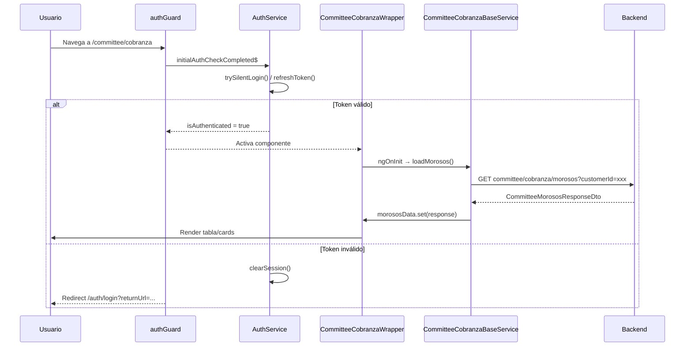

# Módulo Committee LuxuryApp - Contexto Completo

## Resumen del Módulo

**Ubicación**: `D:\repos\luxuryapp-api\client\angular\src\app\apps\committee.luxuryapp`

El módulo **Committee** (Comité de Administración) es un portal para **Consejos Directivos / Comités de Condóminos** que proporciona acceso a información financiera, legal, operativa y de comunicación de su edificio/conjunto residencial.

### Características Principales
- **Autenticación**: Requiere login (authGuard en todas las rutas)
- **Multi-cliente**: Filtra datos por `customerId` del usuario logueado
- **Responsive**: Vista Web (≥1024px) y Mobile (<1024px) automática
- **Documentos**: Biblioteca con categorías configurables por cliente
- **Tiempo real**: Indicador de conexión SignalR

---

## Flujo Completo de Autenticación

### 1. Guards de Ruta (`auth.guard.ts`)

```typescript
export const authGuard: CanActivateFn = (route, state) => {
  // 1. Rutas públicas (/publico/*) → acceso directo
  // 2. Verifica conectividad (offline → bloquea)
  // 3. Espera initialAuthCheckCompleted$ (login silencioso)
  // 4. Si autenticado → true
  // 5. Si no → redirige a /auth/login con returnUrl
};
```

### 2. AuthService - Flujo de Inicio (`auth.service.ts`)

```mermaid
graph TD
    A[App Init] --> B{¿Ruta pública?}
    B -->|Sí| C[initialAuthCheckCompleted = true]
    B -->|No| D[trySilentLogin()]
    D --> E[refreshToken()]
    E --> F{¿Token válido?}
    F -->|Sí| G[set currentUserSession + SignalR.start()]
    F -->|No| H[clearSession() → null]
    G --> I[initialAuthCheckCompleted = true]
    H --> I
```

**Estados clave**:
- `currentUserSession: BehaviorSubject<UserTokenDto | null>` - Sesión actual
- `initialAuthCheckCompleted: BehaviorSubject<boolean>` - Flag para guards
- `isAuthenticated$: Observable<boolean>` - Derivado de sesión
- `userRole$` - Primer rol del usuario

### 3. Login Explícito
```typescript
login(credentials): Observable<UserTokenDto> {
  POST /api/auth/login (withCredentials: true)
  → set session + SignalR.start()
}
```

### 4. Refresh Token (Silencioso)
```typescript
refreshToken(): Observable<UserTokenDto> {
  POST /api/auth/refresh (withCredentials: true, SIN interceptores)
  → actualiza currentUserSession + SignalR.start()
}
```

### 5. Logout
```typescript
logout(): Observable<any> {
  POST /api/auth/logout (sin interceptores)
  → clearSession() + navega a /auth/login
}
```

### 6. ClearSession
```typescript
clearSession() {
  SignalR.stop()
  currentUserSession = null
  customerIdS.clearCustomerData()
  limpia overlays PrimeNG (p-dialog-mask, p-drawer-mask)
  router.navigate(ROUTES.AUTH.LOGIN)
}
```

---

## Estructura de Rutas (`committee.routing.ts`)

| Path | Componente | Guard | Título |
|------|------------|-------|--------|
| `''` | `HomeComite` | authGuard | Inicio Comité |
| `'cobranza'` | `CommitteeCobranzaWrapper` | authGuard | Cobranza |
| `'directorio'` | `CommitteeDirectorio` | authGuard | Directorio |
| `'profile'` | `CommitteeProfile` | authGuard | Mi Perfil |
| `'board-directors/monthly-meetings'` | `ReunionesMensuales...` | authGuard | Junta Mensual |
| `'board-directors/meeting-minutes'` | `MinutasReuniones...` | authGuard | Minutas |
| `'board-directors/meeting-minutes-detail/:id'` | `Minutas...Detalle` | authGuard | Minuta detalle |
| `'board-directors/building-insurance-policy'` | `PolizaSeguroEdificio` | authGuard | Póliza Edificio |
| `'board-directors/financial-reports'` | `InformesFinancieros...` | authGuard | Informe Financiero |
| `'board-directors/documents'` | `BibliotecaConsejoDirectivo` | authGuard | Documentos |
| `'board-directors/documents/:type'` | `Biblioteca...Detalle` | authGuard | Documento tipo |

### Rutas de Documentos Dinámicas
Generadas desde `documentTypeRoutesConfig` (legal.luxuryapp):
- `incorporation-deeds` → Acta Constitutiva
- `assemblies` → Asambleas
- `maintenance-policy` → Contratos proveedores
- `lawsuits` → Juicios
- `ravine-concession` → Concesión barranca (cliente 3)
- `well-concession` → Concesión pozo (cliente 4)

---

## Componentes Principales

### 1. HomeComite (`home-committee/`)
**Dashboard visual** con tarjetas navegables:
- Junta Mensual → `board-directors/monthly-meetings`
- Minutas → `board-directors/meeting-minutes`
- Informe Financiero → `board-directors/financial-reports`
- Documentos Legales → `board-directors/documents`
- Reglamentos → `board-directors/documents/regulations`
- Póliza Edificio → `board-directors/building-insurance-policy`
- Cobranza → `cobranza`

### 2. CommitteeCobranzaWrapper (`cobranza/`)
**Selector responsive** entre:
- **Web** (`CommitteeCobranzaWeb`): Tabla PrimeNG completa (≥1024px)
- **Mobile** (`CommitteeCobranzaMobile`): Cards compactas (<1024px)

**Servicio base**: `CommitteeCobranzaBaseService`
- `loadMorosos(customerId)` → `GET committee/cobranza/morosos`
- Computed: `avanceCobranza`, `carteraVencida`, `cobranzaJudicial`
- Filtra `saldoPendiente > 0.01` y ordena descendente

**DTOs** (`committee-cobranza.dto.ts`):
- `CommitteeMorososResponseDto`: Resumen + array `propiedades[]`
- `CommitteeMorosoItemDto`: Depto, saldos, clasificación
- `CommitteeClasificacion`: JUDICIAL | MOROSOS | DEUDA CORRIENTE | SIN ADEUDO | ANTICIPOS

### 3. CommitteeDirectorio (`directorio/`)
**Dos vistas segmentadas**:
- **Personal**: Entradas sin `groupName` (admin, conserje, etc.)
- **Casetas**: Entradas con `groupName` (ubicaciones/guardias)

**Detalle**: Modal `DirectorioContactDetail` con teléfono, email, horario semanal

**Endpoint**: `GET committee/directorio/{customerId}`

### 4. CommitteeProfile (`profile/`)
**Funciones**:
- Foto de perfil (subida + procesamiento 1MB/1024px + cache-busting)
- Cambio de contraseña (valida actual + nueva + confirmación → logout tras éxito)

**Endpoints**:
- `PUT users/update-image/{applicationUserId}` (multipart)
- `PUT users/change-password/{applicationUserId}`

### 5. BibliotecaConsejoDirectivo (`board-directors-library/`)
**Categorías de documentos** filtradas por `customerId`:
| Categoría | RouteParam | Clientes permitidos |
|-----------|------------|---------------------|
| Acta Constitutiva | `incorporation-deeds` | Todos |
| Asambleas | `assemblies` | Todos |
| Contratos proveedores | `maintenance-policy` | Todos |
| Juicios | `lawsuits` | Todos |
| Concesión barranca | `ravine-concession` | Solo `["3"]` |
| Concesión pozo | `well-concession` | Solo `["4"]` |

**Detalle**: `BibliotecaConsejoDirectivoDetalle` (componente compartido) recibe `documentType` por route data

### 6. Reuniones Mensuales (`board-directors-monthly-meetings/`)
**Tabla PrimeNG** con:
- Vista PDF (minutas, grabaciones)
- Filtro global + paginación
- **Endpoint**: `GET committee/board-directors/monthly-meetings/{customerId}`

### 7. Minutas Reuniones (`board-directors-meeting-minutes/`)
- Lista: `MinutasReunionesConsejoDirectivo`
- Detalle: `MinutasReunionesConsejoDirectivoDetalle` (recibe `:id`)
- **Endpoints**:
  - Lista: `GET committee/board-directors/meeting-minutes/{customerId}`
  - Detalle: `GET committee/board-directors/meeting-minutes-detail/{id}`

### 8. Informes Financieros (`board-directors-financial-reports/`)
**Tabla PrimeNG** idéntica a reuniones mensuales
- **Endpoint**: `GET committee/board-directors/financial-reports/{customerId}`

### 9. Póliza Seguro Edificio (`poliza-seguro-edificio/`)
**Endpoint**: `GET committee/library/building-insurance/{customerId}`

---

## Servicios Compartidos / Core

### CustomerIdService
```typescript
customerId(): string | null  // Signal reactivo del customerId actual
setCustomerId(id: string)    // Setea tras login exitoso
clearCustomerData()          // Limpia en logout
```

### ApiResponseService
Wrapper HTTP con:
- `onGetItem<T>(url)` → Single item
- `onGetList<T>(url)` → Array
- `onPost/onPut/onDelete`
- Manejo de errores + toasts automáticos

### DialogHandlerService
```typescript
openDialog(component, data, title, size, autoMaximize)
openDialogCustom(component, config)
```
Usado para: PDF Viewer, Contact Detail, modales varios

### PdfViewerModal
Visor PDF modal (lazy-loaded) con `ng2-pdf-viewer`

### SignalRService
Conexión tiempo real para notificaciones push
- `start()` / `stop()` llamados en login/logout/refresh

---

## Endpoints Backend (Committee)

```typescript
// Board Directors
GET committee/board-directors/financial-reports/{customerId}
GET committee/board-directors/meeting-minutes/{customerId}
GET committee/board-directors/meeting-minutes-detail/{id}
GET committee/board-directors/monthly-meetings/{customerId}

// Cobranza
GET committee/cobranza/morosos?customerId={id}&year={y}&month={m}
GET committee/cobranza/morosos/{numCta}/detalle?customerId={id}

// Directorio
GET committee/directorio/{customerId}

// Biblioteca
GET committee/library/building-insurance/{customerId}
GET committee/library/custom-documents/{customerId}/{documentType}
GET committee/library/policy-contracts/{customerId}/{isCurrent}
```

---

## Flujo de Datos Típico (ej: Cobranza)



---

## Patrones de Arquitectura

### 1. Signals + Computed (Reactivo)
```typescript
// Estado base
data = signal<DTO[]>([]);

// Derivados computados
readonly filtered = computed(() => data().filter(...));
readonly metrics = computed(() => calculate(data()));
```

### 2. Wrapper Responsive
```typescript
// committee-cobranza-wrapper.ts
isCompact = signal(window.innerWidth < 1024);
template: @if (isCompact()) <mobile/> @else <web/>
```

### 3. Lazy Loading Rutas
```typescript
loadComponent: () => import('./path/component').then(m => m.Component)
```

### 4. CustomerId Context
Todos los endpoints requieren `customerId` del usuario autenticado:
```typescript
const customerId = this.customerIdS.customerId();
if (!customerId) return; // Guard fail-safe
```

### 5. Error Handling Centralizado
`ApiResponseService` maneja:
- HTTP errors → toasts
- Loading states
- Validación de formularios

---

## Configuración por Cliente

### Documentos restringidos
```typescript
// biblioteca-consejo-directivo.ts
allowedCustomerIds: ["3"]  // Solo cliente 3 ve "Concesión barranca"
allowedCustomerIds: ["4"]  // Solo cliente 4 ve "Concesión pozo"
```

### Imágenes Home
`assets/images/comite/*.jpg` - Tarjetas del dashboard

---

## Checklist de Desarrollo

- [ ] Todas las rutas protegidas con `authGuard`
- [ ] `CustomerIdService` inyectado en componentes que llaman API
- [ ] `loading` signal en llamadas async
- [ ] `finally` para resetear loading
- [ ] Filtros por `customerId` en endpoints
- [ ] Responsive: wrapper web/mobile donde aplique
- [ ] Signals para estado, computed para derivados
- [ ] PDF Viewer via `DialogHandlerService.openDialog(PdfViewerModal, ...)`
- [ ] SignalR start/stop en auth flow

---

## Archivos Clave para Referencia Rápida

| Archivo | Propósito |
|---------|-----------|
| `committee.routing.ts` | Definición de rutas + guards |
| `home-committee/home-comite.ts` | Dashboard principal |
| `cobranza/committee-cobranza-wrapper.ts` | Selector responsive cobranza |
| `cobranza/committee-cobranza-base.service.ts` | Lógica compartida cobranza |
| `directorio/directorio.ts` | Directorio personal/casetas |
| `profile/committee-profile.ts` | Perfil + foto + password |
| `board-directors-library/biblioteca-consejo-directivo.ts` | Biblioteca documentos |
| `interfaces/*.dto.ts` | Tipos TypeScript |
| `core/constants/endpoints/committee.endpoints.ts` | URLs API |
| `core/auth/guards/auth.guard.ts` | Guard autenticación |
| `core/auth/services/auth.service.ts` | Servicio auth completo |

---

*Generado automáticamente - Actualizar al modificar el módulo*