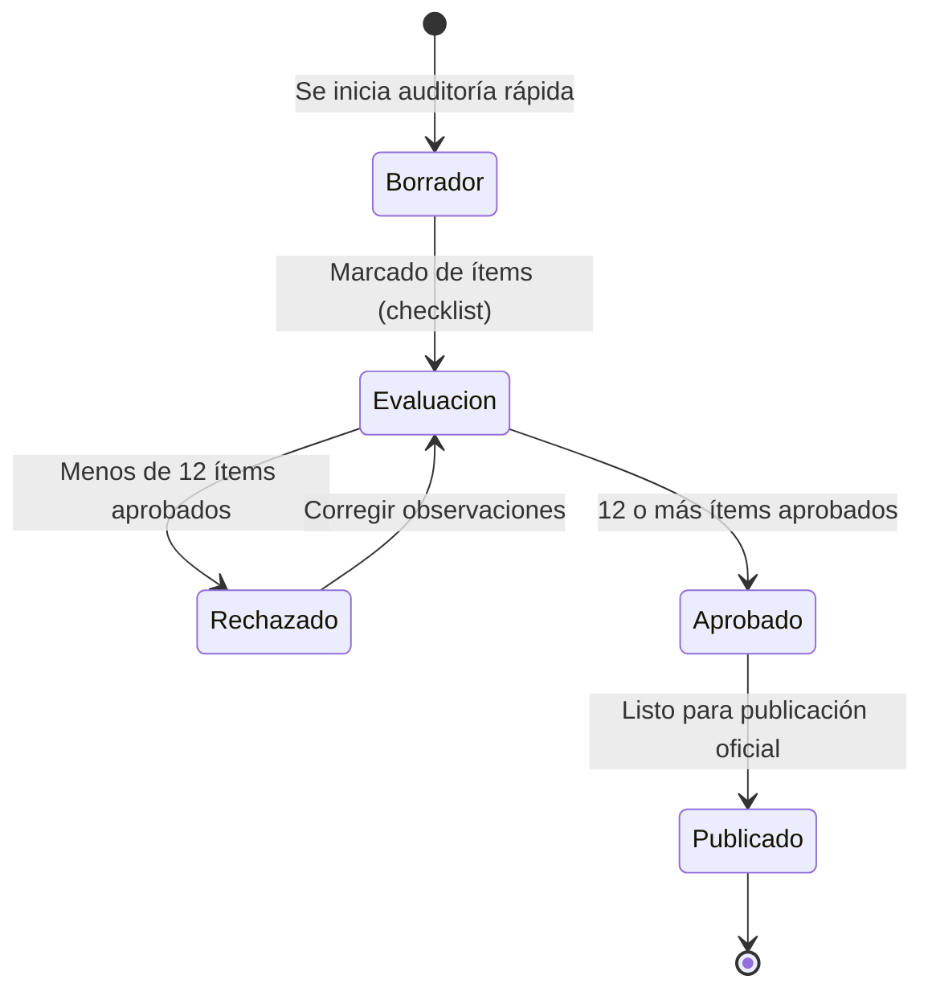
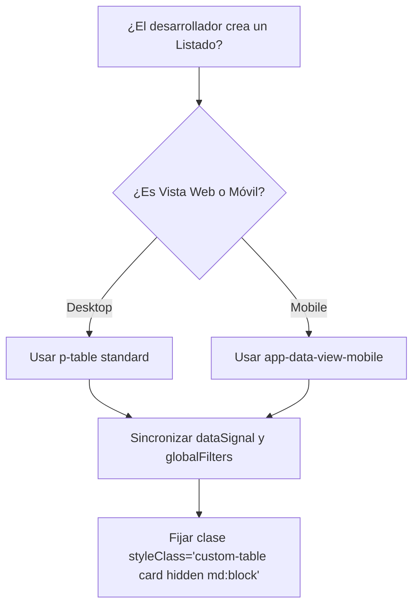

Ruta: 📂 Documentación > 🎨 Sistema > 💻 Catálogo de Diseño UI

📅 Última Revisión: 17-jun-26
🛡️ Estado: [Vigente]
👤 Responsable: Agente Antigravity

---

# 🚀 Reporte de Análisis y Áreas de Oportunidad: Catalog UI

El componente `CatalogComponentUi` actúa como la guía viva del **Sistema de Diseño de LuxuryApp**. Es el punto de referencia clave para que los desarrolladores y diseñadores del proyecto conozcan, visualicen y reutilicen los componentes estándar (botones, campos de entrada, tablas, gráficos, etc.) tanto en la web como en la versión móvil (Ionic). 

Dado que LuxuryApp es un ERP premium enfocado a la administración de residencias y servicios de lujo, este catálogo debe modelar la máxima excelencia técnica, coherencia visual e institucionalidad.

---

## 📊 1. Resumen Ejecutivo (Gerencia)

Este nivel describe el impacto comercial y operativo del catálogo de diseño en el ERP.

El sistema de diseño de LuxuryApp es la base que garantiza una **experiencia de usuario (UX) consistente y de alto nivel**. Un catálogo de componentes desactualizado o que no cumple las reglas internas provoca desalineación visual, inconsistencia en pantallas operativas y un aumento en el tiempo de desarrollo.

### ⚖️ Matriz de Showcase (Antes vs. Después)

| Aspecto | Antes (Limitación Actual) | Después (Solución Propuesta) | Beneficio para el Negocio |
| :--- | :--- | :--- | :--- |
| **Identidad Cromática** | Colores hardcodeados en gráficos y alertas. Falta de consistencia en modo oscuro. | Variables CSS unificadas (`--ds-*`) y soporte responsivo a temas. | Garantiza un aspecto visual de lujo y profesional en cualquier pantalla y modo. |
| **Estándar Técnico** | Importaciones directas `src/app/core/...`. Omisión de patrones móviles obligatorios. | Uso riguroso de alias `@core` y visualización obligatoria de `app-data-view-mobile`. | Mayor velocidad de carga, código modular y alineación estricta con las Reglas de Oro. |
| **Simulador Móvil** | Simulación forzada de ancho de página que deforma el menú superior. | Contenedor encapsulado en un marco interactivo tipo smartphone (iPhone/Android). | Facilita a QA y diseño validar flujos de forma realista y cómoda. |
| **Base de Diseño ERP** | Componentes aislados y simples. Falta de patrones complejos. | Inclusión de patrones Maestro-Detalle, KPIs y Filtros Avanzados. | Acelera el desarrollo de pantallas financieras y operativas complejas. |
| **Integración de Normativas** | Guías de Toolbars, Tablas Fijas y PDFs dispersas en archivos aislados. | Integración directa y visual de las 3 normativas en el catálogo. | Unifica las reglas de desarrollo en un único catálogo interactivo y consultable. |

---

## 📖 2. Guía Funcional (Usuarios/QA)

Este nivel detalla el glosario no técnico y el comportamiento funcional esperado del catálogo interactivo.

### 🗣️ Glosario Non-Tech (Lenguaje de Oficina)
*   **ERP (Sistema de Planificación de Recursos)**: El software central que gestiona la contabilidad, compras, mantenimiento y administración de la empresa.
*   **Modo Oscuro (Dark Mode)**: Configuración visual que cambia el fondo claro por tonos oscuros para reducir la fatiga visual del usuario.
*   **Simulador de Dispositivo**: Herramienta visual que permite probar cómo se verá la aplicación en la pantalla de un teléfono celular sin necesidad de usar un dispositivo real.
*   **Lista Sincronizada (Espejo)**: Diseño que muestra los datos en formato de tabla clásica en una computadora, pero que cambia automáticamente a una lista vertical compacta (tarjetas) cuando se abre en un celular.
*   **Maestro-Detalle**: Estructura de pantalla donde al seleccionar un registro principal (ej. una factura) se muestran inmediatamente sus elementos secundarios (ej. las partidas o conceptos facturados).
*   **Ajuste de Texto (Word Wrap)**: Característica que evita que los textos largos se desborden de la pantalla, forzándolos a hacer saltos de línea y dividirse en varios renglones legibles.

### 🔄 Ciclo de Vida del checklist de Auditoría
El catálogo incluye un listado interactivo para auditar documentos corporativos. El flujo del estado de conformidad sigue esta secuencia:

### ✅ Criterios de Éxito para QA
Al operar el catálogo, el usuario de pruebas debe lograr:
1.  Alternar entre modo claro y oscuro, validando que **todos** los textos sigan siendo 100% legibles (contraste WCAG 2.1 AA).
2.  Copiar al portapapeles cualquier token de color o nomenclatura haciendo clic en él, recibiendo una confirmación visual inmediata y amigable.
3.  Activar la vista de simulador móvil y ver rentados de forma fiel los componentes de Ionic.
4.  Comprobar que en tablas con descripciones largas, el texto haga salto de línea de forma adaptativa sin generar una barra de desplazamiento horizontal en pantallas md y lg.

---

## 📐 3. Análisis e Integración de Normativas de Diseño

Se han extraído e integrado de forma visual las normativas del ERP encontradas en el directorio de documentación de LuxuryApp:

### A. Alineación Perfecta de Toolbars (Guía de Toolbars)
*   **Estándar**: Toda cabecera o caption de tabla que contenga la barra de búsqueda y filtros debe alinearse horizontalmente de forma perfecta.
*   **Implementación en Catálogo**:
    *   Uso de contenedor Flex adaptativo: `flex flex-column md:flex-row md:align-items-center justify-content-between p-2 gap-2 surface-ground border-round`.
    *   Lado Izquierdo: Uso de `primeng-custom-caption` configurando `[noPadding]="true"` y `[noMargin]="true"` para remover paddings/márgenes internos que rompen el Flex.
    *   Lado Derecho: Contenedores de ancho controlado para selectores (`min-width: 140px`) y botones de estado (`width: 130px`) para prevenir que Flexbox los comprima o deforma.

### B. Control de Anchos en Tablas Fijas (Guía de Columnas)
*   **Estándar**: Evitar a toda costa el scroll horizontal en pantallas de computadora y forzar a las celdas a romper palabras cuando el texto es muy extenso.
*   **Implementación en Catálogo**:
    *   Clase de tabla obligatoria: `custom-table-fixed` añadida al `styleClass` de la `p-table`.
    *   Uso de la etiqueta `<colgroup>` y plantillas `<col>` con clases globales centralizadas (ej. `table-col-20`, `table-col-50`, `table-col-30`) para definir de forma predecible la proporción de anchos directamente en el DOM plano.
    *   La columna de descripción demuestra visualmente cómo el texto largo hace un salto de línea limpio sin desplazar las columnas de acción o estado.

### C. Estándares de Impresión PDF (Guía de PDFs)
*   **Estándar**: Todo reporte o vista exportable debe clasificarse en dos modalidades de generación:
    1.  **Data-Driven (HtmlPrintService)**: Para recibos y listados. Prohíbe librerías de canvas. Utiliza iframe oculto e inyecta el encabezado estándar, pie de página y la hoja de estilos institucional (`getStandardCss()`) con tipografía `DM Sans` de respaldo.
    2.  **WYSIWYG (PrintService)**: Para manuales o tableros visuales interactivos. Imprime el DOM en vivo. Requiere aplicar las reglas CSS de `_print.scss` para:
        *   Fijar anchos en columnas PrimeFlex colapsadas (`col-12 lg:col-6 { width: 50% !important }`).
        *   Evitar cortes de tarjetas en saltos de página (`break-inside: avoid !important`).
        *   Compactar tipografía a 11px globales para el ahorro de papel.
        *   Dejar libre la propiedad `@page` para que el usuario elija la orientación (no forzar `landscape`/`portrait`).

---

## 💻 4. Detalle Técnico (Desarrolladores)

Este nivel describe las áreas de oportunidad de código en [catalog-component-ui.ts](file:///d:/repos/luxuryapp-api/client/angular/src/app/features/system/catalogs/catalog-component-ui/catalog-component-ui.ts) y [catalog-component-ui.html](file:///d:/repos/luxuryapp-api/client/angular/src/app/features/system/catalogs/catalog-component-ui/catalog-component-ui.html).

### 1. Incumplimiento de Importaciones `@core` (Regla 3.17)
*   **Problema**: Se importan botones, inputs y utilidades usando rutas directas como `src/app/core/components/...`.
*   **Impacto**: Rompe la regla que prohíbe rutas directas y no utiliza las exportaciones unificadas (barrel exports) del alias `@core`.
*   **Solución**: Cambiar las importaciones al alias `@core/components/buttons/web` e `@core/components/inputs/web` utilizando la desestructuración correspondiente.
*   **Nota de Hot-Reload**: Aunque el alias `@core/*` ya fue registrado en `tsconfig.json` y `vitest.config.ts`, el servidor de desarrollo en caliente (Angular CLI) puede requerir un reinicio manual para leer la nueva configuración de alias. Temporalmente, el uso de rutas completas `"src/app/core/..."` es soportado y garantiza una compilación instantánea sin detener el servidor actual.

---

### 2. Ausencia de la Versión Móvil de la Tabla (`app-data-view-mobile`) (Regla 3.7.1)
*   **Problema**: El catálogo incluye un ejemplo de tabla (`p-table`) en la sección de patrones UX, pero no muestra la versión móvil espejo `app-data-view-mobile`.
*   **Impacto**: Los desarrolladores que utilicen este catálogo como plantilla omitirán la implementación móvil obligatoria para listados.
*   **Solución**: Agregar el componente espejo justo debajo de la `p-table` sincronizando sus inputs.

---

### 3. Colores Hardcodeados y Accesibilidad en Modo Oscuro
*   **Problema 1 (HTML)**: Los bloques visuales de Advertencia, Nota y Buena Práctica usan clases de color quemadas (`bg-yellow-50`, `bg-blue-50`, `bg-green-50`). En modo oscuro, estos fondos claros provocan que las letras claras de la tipografía del sistema pierdan contraste por completo.
*   **Problema 2 (TS/Charts)**: Los gráficos de barras y de pastel inicializan colores fijos en hexadecimal (`#0b3164`, `#065f46`, `#c9a84c`, `#991b1b`). No hay adaptabilidad al cambiar de tema a oscuro.
*   **Solución**:
    *   Para los bloques visuales, utilizar variables CSS institucionales de estado o clases de PrimeFlex que incorporen modificadores de modo oscuro (ej: `bg-yellow-50 dark:bg-yellow-950/20`).
    *   Para los gráficos, usar las variables del tema obtenidas de forma reactiva a través del servicio de temas o computarizadas mediante `getComputedStyle`.

---

### ⚠️ Matriz de Errores y Mensajes al Desarrollador

| Qué salió mal (Error del Dev) | Qué decirle al Desarrollador / Solución |
| :--- | :--- |
| Importación directa desde `src/app/core/...` | "⚠️ Por favor, utiliza el alias `@core` para importar componentes globales. Revisa `skills/frontend-angular/signals-components.md`." |
| Tabla `p-table` sin su espejo móvil | "⚠️ Todo listado con `p-table` debe incluir un espejo `app-data-view-mobile` sincronizado. Revisa `skills/frontend-angular/tables-mobile.md`." |
| Colores de fondo claros quemados en modales/tarjetas | "⚠️ Evita usar clases como `bg-yellow-50` directamente sin su contraparte `dark:bg-yellow-950/20`. Provoca problemas de accesibilidad de contraste en modo oscuro." |
| Tabla de datos sin colgroup ni anchos fijos | "⚠️ Si tu tabla contiene campos de texto extensos, añade la clase `custom-table-fixed` e implementa la plantilla `#colgroup` con las clases `table-col-[valor]` para evitar scroll horizontal." |

---

_LuxuryApp — Excelencia en Software de Administración Inmobiliaria Premium_
