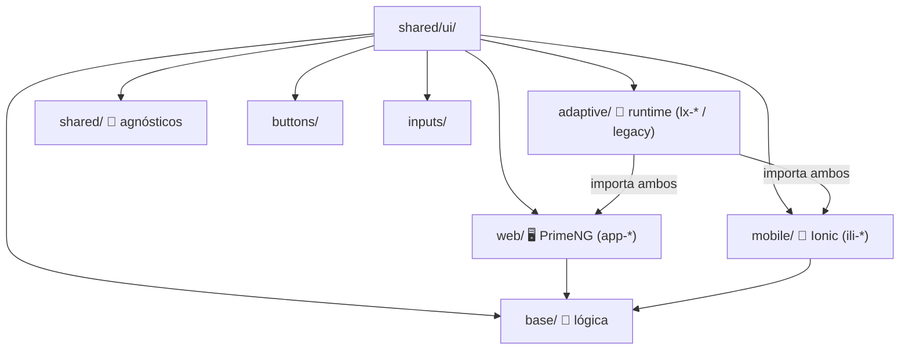
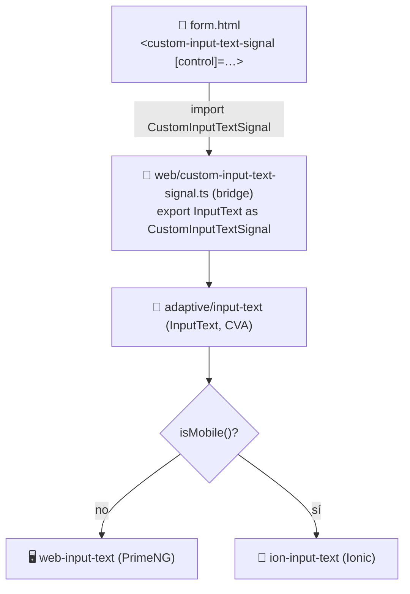

Ruta: 📂 client/angular > 🧩 src/app > 🤝 shared > 🎨 ui

> 📅 Última Revisión: 06-jul-26
> 🛡️ Estado: Vigente — librería consolidada; rollout de inputs adaptativos en curso
> 👤 Responsable: geshyrihu

# 🎨 `shared/ui` — Librería de componentes (web PrimeNG ↔ móvil Ionic)

Documento maestro para **retomar en otra sesión**. Explica cómo está organizada la
librería, cómo se usa, el patrón **adaptativo** de inputs, los estilos/overlays
móviles y las reglas que la mantienen sana.

---

## 1. 🎯 Resumen Ejecutivo

La app tiene **dos UIs**: escritorio con **PrimeNG** y móvil con **Ionic**. Toda la
librería de componentes vive en **`src/app/shared/ui/`** (antes en `core/components`,
ya eliminado). La regla central: **web y móvil son independientes por tipo de
componente**; solo comparten **lógica** (bases `*.base.ts`). Una capa `adaptive/`
elige web o móvil en runtime.

| Concepto | Dónde |
|---|---|
| Alias de import | `@ui/*` → `src/app/shared/ui/*` (en `tsconfig.json`) |
| Regla de fronteras | `npm run audit:ui` (`scripts/audit-ui-boundaries.mjs`, dentro de `npm run lint`) |
| Selección de plataforma | `PlatformService.isMobile()` (viewport, reactivo por `BreakpointObserver`) |

> [!IMPORTANT]
> **web/ nunca importa Ionic** · **mobile/ nunca importa PrimeNG** · **base/ no
> importa ninguno** (solo `@angular/core`) · **adaptive/ es la única capa que cruza.**
> Los `import type` se permiten en cualquier capa (se borran en compilación).

---

## 2. 🗂️ Estructura de carpetas

```
src/app/shared/ui/
├── base/            🧠 lógica compartida (BaseInputSignal, *.base.ts) — sin UI de plataforma
├── web/             🖥️ implementaciones PrimeNG · selector app-* (interno: web-*)
├── mobile/          📱 implementaciones Ionic   · selector ili-*
├── adaptive/        🔀 delegadores que eligen web/móvil en runtime · selector lx-* (o legacy)
├── shared/          🔧 agnósticos (app-icon, focus-trap, loader, kpi-card, …) — Angular puro
├── buttons/         🔘 sistema de botones (base + web-*/mobile-* + shared helpers)
└── inputs/          ✍️ sistema de inputs (base + web/ + mobile/ + adaptive/ + bridges)
```



---

## 3. 🔤 Convención de selectores

| Capa | Tecnología | Selector | Ejemplo |
|---|---|---|---|
| 🖥️ Web | PrimeNG | `app-*` | `app-status-badge` |
| 📱 Móvil | Ionic | `ili-*` | `ili-status-badge` |
| 🔀 Adaptativo (componentes) | elige runtime | `lx-*` | `lx-status-badge` |
| 🔧 Agnóstico | Angular puro | `app-icon`, directivas | `app-icon`, `[appFocusTrap]` |
| ✍️ Inputs (adaptativo) | elige runtime | **legacy conservado** | `custom-input-text-signal` |

> [!NOTE]
> Los **inputs** son un caso especial: el delegador adaptativo **conserva el
> selector histórico** (`custom-input-*-signal`) para no reescribir las ~360
> plantillas de formularios. Ver §5.

### Botones (prefijos)
| Prefijo | Qué es |
|---|---|
| `app-*` / `il-*` (label) / `iw-*` (icon) | Botones **web** (PrimeNG) |
| `ili-*` (label) / `ii-*` (icon) | Botones **móviles** (Ionic) |

Los botones móviles aceptan `variant` semántico (`primary, secondary, outline,
text, danger, ghost`) + alias de las variantes web (`outlined, ghost-text, link,
solid`). Un `variant` desconocido cae a `fill`/`color` (no crashea). Ver
`buttons/BUTTON-USAGE-RULES.md`.

---

## 4. ✍️ Inputs adaptativos — el patrón (LO MÁS IMPORTANTE)

Objetivo: un formulario renderiza **input PrimeNG en web** y **input Ionic en móvil**
automáticamente, **sin cambiar el HTML del form** ni la lógica del `FormGroup`.

### 4.1 Anatomía (3 piezas por tipo)
```
inputs/
├── base/base-input-signal.ts          🧠 CVA + inputs (control, label, required…) compartido
├── web/input-<x>/input-<x>.ts          🖥️ Web<X> · selector web-input-<x>  (PrimeNG, interno)
├── mobile/ion-input-<x>.ts             📱 IonInput<X> · selector ion-input-<x> (Ionic)
├── adaptive/input-<x>/input-<x>.ts     🔀 Input<X> · selector custom-input-<x>-signal (delegador CVA)
└── web/custom-input-<x>-signal.ts      🌉 BRIDGE: re-exporta el adaptativo con la clase histórica
```



### 4.2 Por qué el bridge
Los ~360 formularios importan `CustomInput<X>Signal` desde
`@ui/inputs/web/custom-input-<x>-signal`. Ese archivo pasó a ser un **bridge** de una
línea que re-exporta el **delegador adaptativo**. Resultado: **cero cambios en los
forms** (mismo import, mismo selector en el HTML) y todos se vuelven adaptativos.

### 4.3 El delegador es un CVA
`Input<X>` extiende `BaseInputSignal` (que ya implementa `ControlValueAccessor` con
`internalControl`) y **registra `NG_VALUE_ACCESSOR`**. Por eso soporta las 3 formas:
`[control]="ctrl"`, `formControlName="x"` y `[(ngModel)]`. Pasa
`[control]="control() || internalControl"` al hijo.

### 4.4 ✅ Estado del rollout
| Tipo | Adaptativo | Notas |
|---|---|---|
| text | ✅ | piloto + rollout |
| select | ✅ | incluye `data/optionLabel/optionValue/filter/selectionChange` |
| number | ✅ | |
| textarea | ✅ | |
| checkbox | ✅ | `checkChange` |
| **date** | ⏳ | ⚠️ impedancia string↔Date (web flatpickr vs móvil `type=date`) — hacer con cuidado |
| **autocomplete, file** | ⏳ | valor/UX complejos |
| currency, password, multiselect, select-bool, time, search, switch/toggle | ⏳ | mismo patrón, pendientes |

### 4.5 🧑‍🍳 Receta: agregar un tipo nuevo (ej. `currency`)
1. **web-impl**: copiar `web/custom-input-currency-signal.ts` a
   `web/input-currency/input-currency.ts`; renombrar clase → `WebInputCurrency`,
   selector → `web-input-currency`; arreglar import de base a `../../base/…`.
2. **adaptive**: crear `adaptive/input-currency/input-currency.ts` (clase
   `InputCurrency`, selector `custom-input-currency-signal`), que:
   - `extends BaseInputSignal`, `providers: [NG_VALUE_ACCESSOR → InputCurrency]`;
   - template `@if (platform.isMobile()) <ion-input-currency…/> @else <web-input-currency…/>`;
   - forwardea `[control]="control() || internalControl"` + props comunes + específicas.
3. **bridge**: sobrescribir `web/custom-input-currency-signal.ts` con
   `export { InputCurrency as CustomInputCurrencySignal } from "../adaptive/input-currency/input-currency";`
4. **Declarar TODOS los inputs** que el componente web original tenía (aunque no se
   usen en el template) para no romper forms que los bindeen.
5. `npm run audit:ui` + `ng build` verdes. HTML de los forms NO se toca.

---

## 5. 📱 Comportamiento y estilos móviles

### 5.1 Inputs Ionic (outline)
- Todos usan `fill="outline"` + **`mode="md"`** (la app corre en modo iOS, donde el
  outline no se dibuja; `md` lo activa).
- El estilo lo maneja el **theme global** `src/styles/mobile/_ionic-rn-theme.scss` §9:
  se deja el **outline nativo de Ionic** y solo se le dan colores de marca por CSS
  vars (`--border-color`, `--highlight-color-focused/invalid`). **No** border manual.
- Separación entre campos: `:host { margin-bottom: 1rem }` en `base-ionic-input`.

> [!WARNING]
> No pongas `[disabled]` en los `ion-input-*` (choca con reactive forms → warning
> "changed after checked"). El `effect` de `BaseInputSignal` ya deshabilita el control.

### 5.2 Formularios en móvil = diálogo PrimeNG montado en `<ion-app>`
Los forms se abren con `DialogHandlerService.openDialog(...)` (PrimeNG DynamicDialog).

> [!IMPORTANT]
> **Overlays de Ionic detrás del diálogo — resuelto.** `<ion-app>` tiene
> `contain: layout size style` → contexto de apilamiento en z-index 0. Los overlays
> de Ionic (action-sheet del `ion-select`, pickers) se montan dentro de `ion-app`;
> si el diálogo vive en `<body>` (z-index 1100) quedan **detrás**. Solución:
> `DialogHandlerService` monta el diálogo con **`appendTo = <ion-app>`** cuando existe
> (móvil) → comparten contexto y el z-index de los overlays (20001) gana. En desktop
> no hay `ion-app` → cae a `"body"`. (`core/services/dialog-handler.service.ts`.)

### 5.3 Panel del `p-select` en web
PrimeNG 21 inyecta en runtime `.p-component.p-select-overlay` con un surface oscuro;
en `styles/web/_prime-dropdown.scss` se fuerza `background: var(--ds-bg-surface)
!important` en el panel y `transparent` en las opciones.

---

## 6. 🔒 Fronteras + estilos por capas

- **Audit**: `npm run audit:ui` falla si `mobile/` importa PrimeNG/web, `web/` importa
  Ionic/mobile, o `base/` importa PrimeNG/Ionic. `adaptive/` exento. `import type` permitido.
- **Estilos** (`src/styles/`, misma filosofía): `core/` (tokens SSOT) · `web/`
  (PrimeNG + clases DS) · `mobile/` (Ionic: ionic-rn-theme, ili-buttons, header) ·
  `base/` (global, dark) · `shared/` (cdk, toast, auth, sidebar). Tokens móviles
  namespaced `--ds-m-*`.

---

## 7. 🧑‍💻 Cómo usar (recetas rápidas)

**Usar un input en un form** (no cambia nada vs. antes):
```ts
import { CustomInputTextSignal } from "@ui/inputs/web/custom-input-text-signal";
// imports: [ReactiveFormsModule, CustomInputTextSignal, …]
```
```html
<custom-input-text-signal [control]="form.controls.code" label="Código" />
```
→ Se ve PrimeNG en web, Ionic en móvil, automáticamente.

**Usar un componente web/móvil/adaptativo directo:**
```ts
import { StatusBadge } from "@ui/web/status-badge/status-badge";        // solo web
import { MobileStatusBadge } from "@ui/mobile/status-badge/status-badge"; // solo móvil
import { LxStatusBadge } from "@ui/adaptive/status-badge/status-badge";   // adaptativo
```

**Botón móvil:** `<ili-button-save />`, `<ili-button variant="primary" label="…" />`.

---

## 8. ✅ Estado y pendientes (checklist para retomar)
- [x] Librería migrada a `shared/ui` (core/components eliminado); alias `@ui/*`.
- [x] `audit:ui` de fronteras en `npm run lint`.
- [x] Estilos por capas (`src/styles`).
- [x] Overhaul móvil de botones + action-sheet nativo.
- [x] Inputs adaptativos: **text, select, number, textarea, checkbox**.
- [x] Fixes runtime: select-detrás (appendTo ion-app), panel navy web, warning disabled,
  crash de variant, NG0100 SoporteOrdenServicio.
- [ ] Inputs adaptativos restantes: currency, password, multiselect, select-bool, time,
  search, switch/toggle.
- [ ] **date / autocomplete / file** (valor complejo — pase dedicado).
- [ ] Fase 3 (opcional): forms móviles en `ion-modal` nativo en vez de diálogo PrimeNG.
- [ ] Regla ESLint formal de fronteras (hoy es el audit script; el repo no usa ESLint).

---

## 9. 🧯 Gotchas / troubleshooting
| Síntoma | Causa / Fix |
|---|---|
| Overlay Ionic (select/picker) detrás del diálogo en móvil | Ya resuelto vía `appendTo ion-app`. Si reaparece, revisar que la vista tenga `<ion-app>`. |
| Panel `p-select` oscuro en web | Override `!important` en `_prime-dropdown.scss`. |
| Input Ionic sin recuadro / texto pegado | Falta `mode="md"` o el theme le mete border manual (ver §5.1). |
| `Cannot read properties of undefined (reading 'fill')` en botón móvil | `variant` fuera del mapa → ya es defensivo; revisar que no sea un `variant` web en botón móvil. |
| `NG0100 ExpressionChanged…` con datos async | `@if` que voltea al asignar en `.then()`; `cdr.detectChanges()` tras asignar o usar signals. |
| Front rompe al mover un input a adaptativo | Faltó declarar algún `input()` que el web original tenía; agregarlo al delegador. |

---

_Reemplaza cualquier `PLAN-*.md` histórico. Plan de forms móviles:
`docs/plans/20260705-frontend-vista-movil-formularios.md`._
