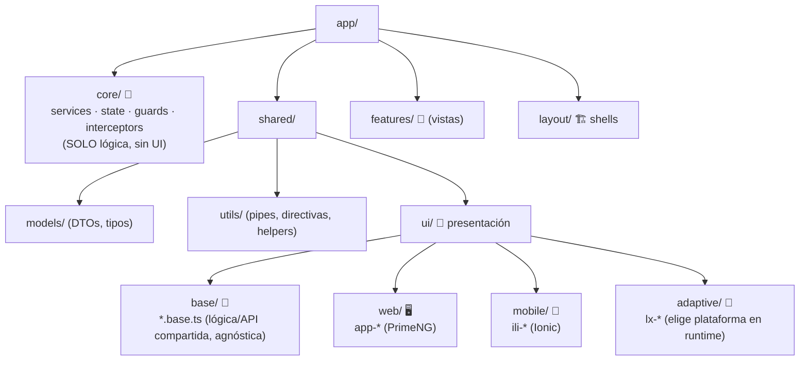
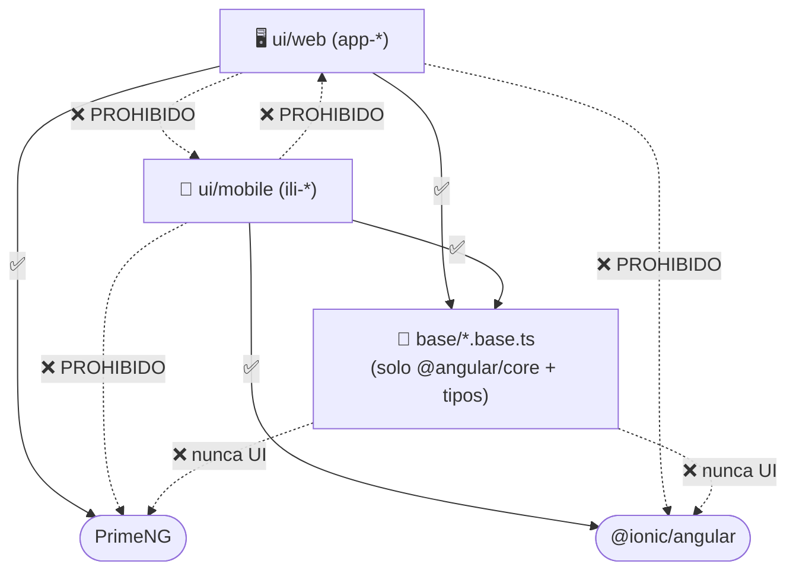

Ruta: 📂 client/angular > 🧩 src/app > 🤝 shared > 🎨 ui

> 📅 Última Revisión: 04-jul-26
> 🛡️ Estado: En Ejecución (17 componentes reubicados · build verde)
> 👤 Responsable: geshyrihu

# 🎨 Arquitectura de `shared/ui` (librería de componentes)

Cómo se organiza la presentación de LuxuryApp para que **web (PrimeNG)** y
**móvil (Ionic)** sean piezas **independientes por tipo**, compartiendo solo la
**lógica**. Basado en `architecture-axample.md`.

---

## 1. 🎯 Resumen Ejecutivo (Gerencia)

> [!NOTE]
> **El porqué.** `core/` mezclaba lógica y UI, y los componentes web/móviles
> estaban entreverados. Separamos: **`core/` = lógica pura**, **`shared/ui/` =
> presentación**, con la web y el móvil en carpetas **físicamente distintas** para
> que nunca se contaminen.

| ⚖️ Antes (Limitación) | ✅ Después (Solución) |
|---|---|
| UI dentro de `core/` junto a servicios/guards | `core/` solo-lógica · UI vive en `shared/ui/` |
| Web y móvil mezclados por nombre | `shared/ui/web/` (PrimeNG) y `shared/ui/mobile/` (Ionic) separados |
| Fácil arrastrar PrimeNG a una vista móvil | Frontera dura: `mobile/` no importa PrimeNG y viceversa |
| Imports por rutas profundas y frágiles | Alias estable `@ui/web/*`, `@ui/mobile/*`, `@ui/base/*` |

**Criterios de éxito** ✅
- [ ] Un dev ubica cualquier componente por plataforma en < 10 s.
- [ ] Imposible (por regla) que móvil importe un componente/estilo web.
- [ ] `ng build` verde en cada tanda.

---

## 2. 🗂️ Estructura objetivo



### Convención de selectores
| Capa | Carpeta | Tecnología | Prefijo |
|---|---|---|---|
| 🖥️ Web | `shared/ui/web/<x>/` | PrimeNG | `app-*` (botones `il-`/`iw-`) |
| 📱 Móvil | `shared/ui/mobile/<x>/` | Ionic | `ili-*` |
| 🔀 Adaptativo | `shared/ui/adaptive/<x>/` | elige en runtime (`PlatformService`) | `lx-*` |
| 🧠 Base | `shared/ui/base/<x>.base.ts` | solo `@angular/core` | (sin selector) |
| 🔧 Agnóstico | `shared/ui/shared/` (o `shared/utils`) | Angular puro / HTML-CSS | `app-icon`, directivas |

---

## 3. 🔒 Garantía de independencia Web ↔ Móvil

> [!IMPORTANT]
> La vista móvil es **independiente de la web en el tipo de componentes**.
> Comparten **lógica** (`base/*.base.ts`), **nunca** implementación de UI.



**Se hará cumplir** con lint de fronteras (pendiente: el repo aún no tiene ESLint):
- `**/ui/mobile/**` → prohibido `primeng*` y `**/ui/web/**`.
- `**/ui/web/**` → prohibido `@ionic*` y `**/ui/mobile/**`.
- `**/ui/base/**` → prohibido `primeng*` **y** `@ionic*`.

### ⚠️ Excepción: `adaptive/` (`lx-*`)
> [!WARNING]
> El wrapper `lx-*` importa **ambas** versiones para elegir en runtime; es el único
> punto que cruza la frontera (mete PrimeNG **e** Ionic en el bundle). Usar solo en
> pantallas híbridas. Una vista que ya sabe su plataforma importa directo
> `@ui/web/<x>/<x>` o `@ui/mobile/<x>/<x>`.

---

## 4. 📤 Imports (aliases)

```ts
// ✅
import { MobileStatusBadge } from "@ui/mobile/status-badge/status-badge"; // móvil
import { StatusBadge } from "@ui/web/status-badge/status-badge";          // web
import { StatusBadgeBase } from "@ui/base/status-badge.base";             // lógica
import { LxStatusBadge } from "@ui/adaptive/status-badge/status-badge";   // adaptativo
```

`tsconfig.json` › `paths`: `@ui/* → src/app/shared/ui/*`.
(Alias legacy `@components/*` se retira tras el codemod.)

---

## 5. 🚚 Estado de la migración
Ver plan y checklist: `docs/plans/20260704-frontend-reorganizacion-core-components.md`.
- ✅ 17 componentes de ambas plataformas reubicados a `shared/ui`.
- ⏳ Resto de `core/components` (web-only, mobile-only, buttons, inputs, agnósticos)
  y estilos por capas.

---

## 6. ✅ Checklist de lectura
- [ ] Sé si un componente va a `web/`, `mobile/`, `base/` o `adaptive/`.
- [ ] Sé qué alias usar (`@ui/web`, `@ui/mobile`, `@ui/base`).
- [ ] Entiendo por qué `mobile/` no puede importar PrimeNG.

_Reemplaza al doc previo `core/components/arquitectura-core-components.md`._
