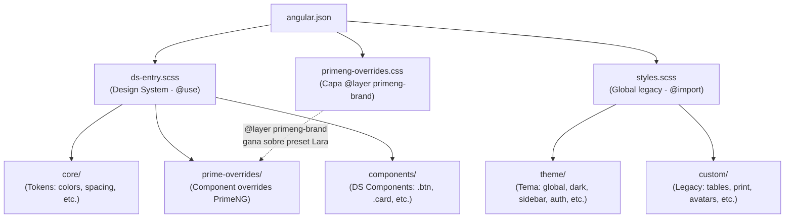
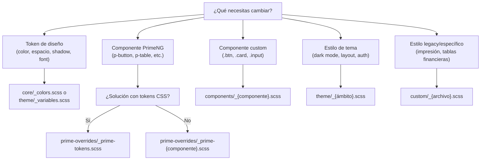

# 🎨 Sistema de Hojas de Estilo — LuxuryApp Frontend

> Ruta: 📂 Documentación > 📱 Frontend > 🎨 Sistema de Hojas de Estilo

---

📅 **Última Revisión:** Junio 2026  
🛡️ **Estado:** Vigente  
👤 **Responsable:** Equipo Frontend

---

## 📋 Resumen Ejecutivo

El directorio `client/angular/src/styles/` contiene **todos los estilos globales, tokens de diseño, overrides de PrimeNG y componentes custom** de la aplicación LuxuryApp. Está estructurado en **6 subdirectorios y 2 archivos raíz** que se cargan desde `angular.json` y se importan mutuamente según una jerarquía de cascada predefinida.

> ✅ **Criterio de Éxito:** Al finalizar la lectura, entenderás qué archivo modificar según el tipo de cambio visual que necesites, y las reglas de cascada que garantizan consistencia.

---

## 🏗️ Arquitectura General



### Tipos de Carga

| Mecanismo | Archivo | Propósito |
|-----------|---------|-----------|
| `angular.json` (build) | `ds-entry.scss` | Design System — `@use` (SCSS moderno) |
| `angular.json` (build) | `primeng-overrides.css` | Overrides de marca PrimeNG — `@layer` CSS |
| `angular.json` (build) | `styles.scss` | Estilos globales legacy — `@import` |
| `@use` desde DS | `core/`, `prime-overrides/`, `components/` | Tokens y componentes DS |
| `@import` desde styles | `theme/`, `custom/` | Tema, dark mode y legacy |

---

## 📁 Estructura de Archivos

### 2️⃣ Archivos Raíz

| Archivo | Líneas | Rol |
|---------|--------|-----|
| [`ds-entry.scss`](#ds-entryscss) | 43 | 🚀 Punto de entrada del Design System (DS). Usa `@use`. No incluye reset ni tipografía global. |
| [`primeng-overrides.css`](#primeng-overridescss) | 319 | 🅿️ Overrides de marca para PrimeNG v21 dentro de `@layer primeng-brand`. Sin `!important` ni `::ng-deep`. |
| [`styles.scss`](#stylesscss) | 107 | 📜 Hoja maestra legacy. Usa `@import`. Incluye reset, Ionic CSS, componentes custom y animaciones. |

### 📂 Subdirectorios

| Directorio | Archivos | Rol |
|------------|----------|-----|
| [`core/`](#-core) | 8 | 🎯 Tokens fundamentales del DS (colores, spacing, borders, shadows, typography, functions, mixins) |
| [`components/`](#-components) | 7 | 🧩 Componentes puros del DS (buttons, inputs, forms, cards, tables, alerts, dropdowns) |
| [`prime-overrides/`](#-prime-overrides) | 9 | 🅿️ Overrides por componente PrimeNG (button, input, card, dialog, table, dropdown, tag, message, tokens) |
| [`theme/`](#-theme) | 9 | 🌓 Estilos de tema (variables, global, dark-mode, sidebar, auth, toast, header-mobile, ionic, cdk) |
| [`custom/`](#-custom) | 10 | 📦 Estilos legacy y específicos (avatars, list, custom-table, financial-tables, print, loader, utilities) |

---

## 🚀 `ds-entry.scss`

Punto de entrada del **Design System**. Se carga primero en `angular.json` para que los tokens DS y overrides de PrimeNG tengan prioridad de cascada sobre los estilos legacy.

```scss
// 1. Core tokens and helpers.
@use "core/functions";
@use "core/colors";
@use "core/spacing";
@use "core/borders";
@use "core/shadows";
@use "core/mixins";

// 2. PrimeNG overrides.
@use "prime-overrides/prime-tokens";
@use "prime-overrides/prime-input";
@use "prime-overrides/prime-button";
@use "prime-overrides/prime-card";
@use "prime-overrides/prime-message";
@use "prime-overrides/prime-dialog";
@use "prime-overrides/prime-tag";
@use "prime-overrides/prime-table";
@use "prime-overrides/prime-dropdown";

// 3. Design System components.
@use "components/buttons";
@use "components/inputs";
@use "components/forms";
@use "components/cards";
@use "components/tables";
@use "components/alerts";
@use "components/dropdowns";
```

> 💡 **Diferencia clave:** `ds-entry.scss` usa `@use` (no `@import`) y no incluye `_reset.scss` ni `_typography.scss` para evitar reseteos globales conflictivos.

---

## 🅿️ `primeng-overrides.css`

Archivo CSS plano que centraliza **todos los overrides visuales de PrimeNG** en una **capa CSS** (`@layer primeng-brand`). Orden de capas definido en `angular.json`:

```
PrimeNG base → @layer primeng-brand → PrimeFlex utilities
```

### Componentes overrideados

| Componente | Variables clave |
|------------|-----------------|
| `.p-button` | `height: 40px`, `--ds-*` tokens, colores primary/secondary/success/danger |
| `.p-inputtext` | `height: 40px`, focus ring, disabled/error states |
| `.p-select` | Altura y bordes consistentes con inputs |
| `.p-datatable` | Header primario, hover, highlight, celdas |
| `.p-dialog` | Border radius, header/content/footer padding |
| `.p-tag` | Tamaños y colores semánticos |
| `.p-message` | Borde izquierdo de acento (4px) |
| `.p-card` | Border radius, shadow, surface background |
| `.p-datepicker` | Border radius, shadow |
| Focus ring global | `:focus-visible` con `--ds-border-focus` |

> ⚠️ **Reglas:** No usar `!important`, no usar `::ng-deep`, preferir variables `--p-*`, selectores simples.

---

## 📜 `styles.scss`

Hoja maestra legacy que se carga **después** del DS. Organizada en secciones numeradas:

1. **Variables & Tokens** → `theme/_variables.scss`
2. **Base** → Reset de `box-sizing`
3. **Custom** → Iconos y utilidades
4. **Tema Core** → Global, toast, header-mobile, Ionic CSS, auth, dark-mode
5. **Componentes Custom** → Avatars, list, tables, financial-tables, print
6. **Sidebar** → `theme/_sidebar.scss`
7. **Fonts** → DM Sans (cargado desde index.html)
8. **Iconify** → Display inline-block estándar
9. **Animaciones** → `ds-animate-spin`

---

## 🎯 `core/` — Tokens del Design System

Fuente única de verdad para **colores, tipografía, espaciado, bordes, sombras, funciones y mixins**.

| Archivo | Contenido |
|---------|-----------|
| `_colors.scss` | Paletas completas 50-950 para primary, secondary, success, warning, danger, info, help, contrast, neutral. Colores semánticos derivados. |
| `_typography.scss` | Familias (Hanken Grotesk, Inter, JetBrains Mono), escala modular 1.25, pesos, interlineado, clases utilitarias `text-*`, estilos de encabezados h1-h6. |
| `_spacing.scss` | Escala base 4px (`$space-0` a `$space-48`), espaciado semántico para componentes (padding de botones, inputs, cards, modales). |
| `_borders.scss` | Grosor de borde, border-radius (none → full), variables CSS `--ds-radius-*`. |
| `_shadows.scss` | Escala de sombras (none → 2xl), focus rings, variables CSS `--ds-shadow-*`. |
| `_variables.scss` | Punto de entrada unificado: importa todos los módulos core, define breakpoints, z-index, tamaños de componentes, opacidades. |
| `_functions.scss` | Funciones: `rem()`, `px()`, `alpha()`, `contrast-color()`, `space()`, `fluid-size()`, `depth-shadow()`. |
| `_mixins.scss` | Mixins: `respond-to()` (responsive), `focus-ring()` (accesibilidad), `disabled-state()`, `loading-spinner()`, `skeleton()`, `truncate()`, `flex-center()`, `overlay-backdrop()`, `custom-scrollbar()`, `elevation()`, `color-variant()`. |

---

## 🧩 `components/` — Componentes del DS

Clases **puras en CSS** (sin depender de PrimeNG) que forman el catálogo de componentes del Design System.

| Archivo | Clase principal | Variantes |
|---------|----------------|-----------|
| `_buttons.scss` | `.btn` | `.btn-primary`, `-secondary`, `-danger`, `-success`, `-warning`, `-info`, `-help`, `-contrast` + outline, ghost, link; tamaños `xs`-`xl`; `.btn-icon`, `btn-group`, `btn-icon-shell` |
| `_inputs.scss` | `.input` | `.input-error`, `-success`, `-warning`; tamaños `xs`-`xl`; `.textarea`, `.input-group` (prefix/suffix), `.checkbox`, `.radio`, `.toggle` (switch) |
| `_forms.scss` | `.form-group` | `.form-group--horizontal`, `--inline`; `.form-label`, `.form-error`, `.form-success-msg`, `.form-hint`; `.form-section`, `.form-fieldset`, `.form-actions`, `.form-grid` (2-4 col), `.form-wizard` |
| `_cards.scss` | `.card` | `.card--flat`, `--elevated`, `--bordered`, `--interactive`, `--selected`, `--primary/success/warning/danger/info`; `.card-header/body/footer/title/subtitle/meta`; `.card-grid` |
| `_tables.scss` | `.table` | `.table--striped`, `--hover`, `--bordered`, `--borderless`, `--compact`, `--spacious`; filas semánticas, celdas numéricas, ordenación, toolbar, paginación |
| `_alerts.scss` | `.alert` / `.toast` | Modales (`modal-*` 6 tamaños), drawers (`drawer--left/right`), `toast` con barra de progreso, posiciones |
| `_dropdowns.scss` | `.dropdown` | `.dropdown__menu`, `.menu-item` (danger, disabled, active), separadores, grupos + layout de app (`app-shell`, `app-topbar`, `app-layout`, `app-sidebar`, `sidebar-menu`, `page-container`) |

---

## 🅿️ `prime-overrides/` — Overrides por Componente PrimeNG

Cada archivo sobrescribe la apariencia de un componente PrimeNG v21 usando **tokens CSS** (`--p-*`) y selectores con especificidad controlada (`body .p-component`).

| Archivo | Componente | Estrategia |
|---------|-----------|------------|
| `_prime-tokens.scss` | Bridge global | Mapea `--p-*` → `--ds-*` para primary, surface, text, borders, focus, overlay. Clases compatibilidad PrimeNG v16. |
| `_prime-button.scss` | `p-button` | Tokens `--p-button-*` + selector `body .p-button` para padding, border-radius, variants (secondary, danger, success, outlined, text), tamaños sm/lg, rounded icon-only. |
| `_prime-input.scss` | `p-inputtext`, `p-textarea`, `p-inputnumber`, `p-password`, `p-datepicker` | Tokens border-width/radius, altura 40px, disabled state (italic + opacity). |
| `_prime-card.scss` | `p-card` | Border-radius, background, border, shadow. |
| `_prime-message.scss` | `p-message` | Borde izquierdo 4px, backgrounds suaves por severidad (success, info, warn, error, secondary, contrast). |
| `_prime-dialog.scss` | `p-dialog` | Border-radius 16px, header/content/footer padding, backdrop-filter blur. |
| `_prime-tag.scss` | `p-tag` | Border-radius desde token. |
| `_prime-table.scss` | `p-datatable` | Tokens de colores, padding, header uppercase, hover effect, paginador estilizado. |
| `_prime-dropdown.scss` | `p-select`, `p-multiselect`, `p-autocomplete` | Tokens border/radius/focus, overlay panel, opciones con hover/selected. |

---

## 🌓 `theme/` — Estilos de Tema

| Archivo | Líneas | Contenido |
|---------|--------|-----------|
| `_variables.scss` | 507 | ⚙️ **Generador de CSS Custom Properties.** Exporta paletas `--primary-50..950`, `--help-*`, `--ds-*`, `--ion-*`, z-index, shadows, radii, fonts. Incluye **dark mode** (`body.theme-dark`). |
| `_global.scss` | 205 | 🌐 Estilos base: control de scroll móvil, skip-link (WCAG), focus visible, layout Ionic (`ion-app`, `#main-content`), z-index de overlays, estados de badges, validación de formularios. |
| `_dark-mode.scss` | 455 | 🌙 **Overrides globales dark mode** (unlayered). Cubre backgrounds hardcodeados, PrimeNG v16 compat, CDK drag, formularios, tabs, accordion, datatable, dropdowns, calendar, chips, tooltips. Neon glow en cards. |
| `_sidebar.scss` | 364 | 📋 Sidebar: PrimeNG PanelMenu, guide menu custom, monitoreo de scroll, animaciones, breadcrumbs en toolbar. |
| `_auth.scss` | 47 | 🔐 **Glassmorphism** para pantallas de autenticación. Móvil: transparente; Desktop: `backdrop-filter: blur(16px)`. |
| `_toast.scss` | 152 | 🔔 Toast PrimeNG (web) e Ionic toast (mobile). Borde lateral grueso 8px, colores vibrantes, sombra fuerte. |
| `_header-mobile.scss` | 121 | 📱 Perfil y selector de cliente en cabecera móvil: dropdown animado, customer data con imagen y nombre truncado. |
| `_ionic-rn-theme.scss` | 374 | 📱 **Tema Ionic iOS-mode** alineado a Material Design 3 via `--ds-*` tokens. Cubre: `ion-content`, header, list, item, card, button, input, searchbar, segment, chip, badge, refresher, spinner + dark mode. |
| `_cdk-overrides.scss` | 22 | 📦 Overrides de Angular CDK Drag & Drop: preview con sombra, placeholder oculto, animación de transición. |

---

## 📦 `custom/` — Estilos Legacy y Específicos

| Archivo | Líneas | Rol | Único/Cubierto por DS |
|---------|--------|-----|----------------------|
| `_avatars.scss` | 146 | Avatares responsivos (img-100 a img-70), estados online/offline/dnd, grupos superpuestos. | ❌ No cubierto |
| `_list.scss` | 212 | Listas Bootstrap-style: `list-group`, variantes de color, horizontal-list, scrollbar-wrapper. | ❌ No cubierto |
| `_custom-table.scss` | 229 | Wrapper `p-datatable` con scroll vertical, colgroup de anchos, cabeceras navy con gradiente, filas con borde de estado. | ⚠️ Parcial |
| `_custom-table copy.scss` | 90 | Versión anterior/deprecated de `_custom-table.scss`. | 🗑️ Posible dead code |
| `_financial-tables.scss` | 736 | Tablas contables: `rf-*` (reporte financiero), `budget-*` (presupuesto), jerarquías (`fila-nivel-*`), espejo-aspel, vistas móviles. | ❌ No cubierto |
| `_print.scss` | 524 | Estilos de impresión para reportes ejecutivos, estados financieros y manuales. Portada, tabla de tareas, layout reset. | ❌ No cubierto |
| `_utilities.scss` | 17 | Utilidades `tracking-*` y alturas/anchos fijos. | ⚠️ Complemento PrimeFlex |
| `_custom-prime-icons.scss` | 764 | Catálogo completo PrimeIcons como variables CSS `--pi-*` + mixin generador de clases `.icon-pi-*`. | ❌ No cubierto |
| `_design-system-utilities.scss` | 1412 | Catálogo legacy de componentes (dead code donde DS gana). Clases ÚNICAS: `.input-text`, `.btn-luxury`, `.table-luxury`, `.page-title`, divisores, anchos de columna. | ⚠️ Dead code parcial |
| `_loader.scss` | 54 | Loader animation y botón "tap-top" (scroll to top). | ❌ No cubierto |

---

## 🔄 Flujo de Decisión para Cambios Visuales



---

## 📏 Convenios y Reglas

> [!IMPORTANT]
> ### Reglas de Cascada
> 1. **DS gana sobre legacy:** `ds-entry.scss` se carga antes que `styles.scss`
> 2. **`@layer primeng-brand`** tiene prioridad intermedia entre preset PrimeNG y utilidades
> 3. **Unlayered gana sobre `@layer`** (usado en `_dark-mode.scss`)
> 4. **`!important` prohibido** en `primeng-overrides.css`; permitido en `_dark-mode.scss` (unlayered) y legacy
>
> ### Reglas de Código
> - **Prohibido `::ng-deep`** en estilos globales
> - Preferir **variables CSS** (`--ds-*`, `--p-*`) sobre valores hardcodeados
> - **`@use`** para nuevo código DS; **`@import`** solo en legacy (`styles.scss`)
> - Archivos core con prefijo `_` (partials SCSS)

---

## 🧪 Matriz de Errores Comunes

| Qué salió mal | Por qué | Qué decir al usuario |
|---------------|---------|---------------------|
| El cambio no se ve reflejado | El estilo está siendo sobrescrito por otro archivo con mayor prioridad | Verifica si tu cambio está en el archivo correcto según el flujo de decisión. Si es un token, usa `core/`. Si es un override PrimeNG, usa `prime-overrides/`. |
| Un componente PrimeNG se ve distinto a lo esperado | El override está en `primeng-overrides.css` (capa) pero otro estilo unlayered lo sobrescribe | Mueve el override a un archivo unlayered o aumenta especificidad. |
| Dark mode no aplica a un componente | El componente tiene `background` hardcodeado que no está cubierto en `_dark-mode.scss` | Agrega el selector en `_dark-mode.scss` usando `--ds-*` tokens. |
| Error de compilación SCSS | Uso de `@import` dentro de un archivo que usa `@use` | No mezclar `@import` y `@use` en el mismo archivo. Migrar a `@use`. |

---

> 💡 **Tip:** La mayoría de cambios visuales nuevos deben ir en `components/` si es un componente puro, o en `prime-overrides/` si afecta a PrimeNG. Solo tocar `theme/_variables.scss` para nuevos tokens del sistema.

---

_🎯 Documentación generada siguiendo los estándares de alto nivel del proyecto — Junio 2026_
