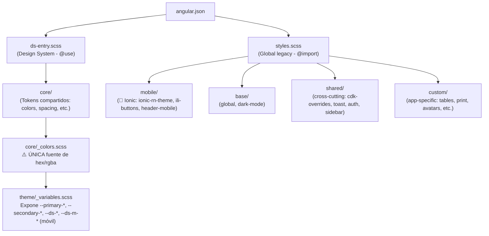
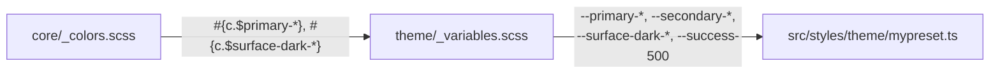
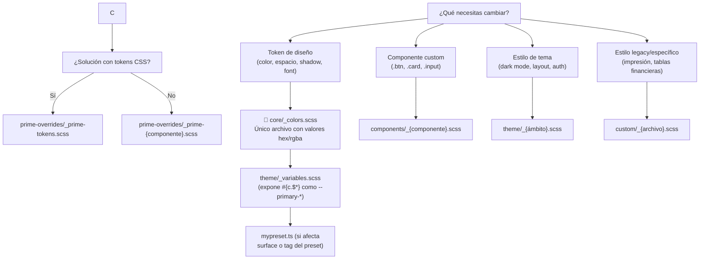

# 🎨 Sistema de Hojas de Estilo — LuxuryApp Frontend

> Ruta: 📂 `appsweb/angular/src/styles/` > 🗂️ `estandar-hoja-estilos.md`

---

📅 **Última Revisión:** 27-jun-26  
🛡️ **Estado:** ✅ Vigente  
👤 **Responsable:** Equipo Frontend

---

## 📋 Resumen Ejecutivo


> ✅ **Criterio de Éxito:** Al finalizar la lectura, entenderás qué archivo modificar según el tipo de cambio visual que necesites, y las reglas de cascada que garantizan consistencia.

> ✅ **Criterio de Éxito:** Al finalizar la lectura, entenderás qué archivo modificar según el tipo de cambio visual que necesites, y las reglas de cascada que garantizan consistencia.

---

## 🏗️ Arquitectura General


```mermaid
flowchart TD
    A["angular.json"] --> B["ds-entry.scss<br/>(Design System - @use)"]
    A --> D["styles.scss<br/>(Global legacy - @import)"]

    B --> E["core/<br/>(Tokens compartidos: colors, spacing, etc.)"]

    D --> Hm["mobile/<br/>(📱 Ionic: ionic-rn-theme, ili-buttons, header-mobile)"]
    D --> Hb["base/<br/>(global, dark-mode)"]
    D --> Hs["shared/<br/>(cross-cutting: cdk-overrides, toast, auth, sidebar)"]
    D --> I["custom/<br/>(app-specific: tables, print, avatars, etc.)"]

    E --> J["core/_colors.scss<br/>⚠️ ÚNICA fuente de hex/rgba"]
    J --> K["theme/_variables.scss<br/>Expone --primary-*, --secondary-*, --ds-*, --ds-m-* (móvil)"]

```

### Tipos de Carga

| Mecanismo | Archivo | Propósito |
|-----------|---------|-----------|
| `angular.json` (build) | `ds-entry.scss` | Design System — `@use` (SCSS moderno) |
| `angular.json` (build) | `styles.scss` | Estilos globales legacy — `@import` |
| `@import` desde styles | `base/`, `mobile/`, `shared/`, `custom/` | App-wide, Ionic, cross-cutting, legacy |

> [!NOTE]
> **Reorg por capas (04-jul-26):** los estilos se separaron en `core/` (tokens
> (cross-cutting). Regla: `web/` no referencia Ionic y `mobile/` no referencia
> se fusionaron en `web/`.

---

## 📁 Estructura de Archivos

### 3️⃣ Archivos Raíz

| Archivo | Líneas | Rol |
|---------|--------|-----|
| [`ds-entry.scss`](#ds-entryscss) | 43 | 🚀 Punto de entrada del Design System (DS). Usa `@use`. No incluye reset ni tipografía global. |
| [`styles.scss`](#stylesscss) | ~107 | 📜 Hoja maestra legacy. Usa `@import`. Incluye reset, Ionic CSS, componentes custom y animaciones. |

---

## 🅿️ `mypreset.ts`



```mermaid
flowchart LR
    A["core/_colors.scss"] -->|"#{c.$primary-*}, #{c.$surface-dark-*}"| B["theme/_variables.scss"]
    B -->|"--primary-*, --secondary-*,<br/>--surface-dark-*, --success-500"| C["src/styles/theme/mypreset.ts"]
```

| Token en mypreset.ts | Fuente en _variables.scss | Fuente última en _colors.scss |
|---------------------|---------------------------|-------------------------------|
| `{primary.500}` | Referencia interna del preset | — |
| `var(--secondary-50..950)` | `--secondary-*: #{c.$secondary-*}` | `$secondary-*` |
| `var(--surface-dark-0..950)` | `--surface-dark-*: #{c.$surface-dark-*}` | `$surface-dark-*` |
| `var(--success-400/500)` | `--success-*: #{c.$success-*}` | `$success-*` |
| `var(--ds-primary-text)` | `--ds-primary-text: #ffffff` | `$neutral-0` |
| `color-mix(in srgb, var(--success-500), transparent 88%)` | `--success-500: #{c.$success-500}` | `$success-500` |

---

### 📂 Subdirectorios

| Directorio | Archivos | Rol |
|------------|----------|-----|
| [`core/`](#-core) | 8 | 🎯 Tokens fundamentales del DS (colores, spacing, borders, shadows, typography, functions, mixins) |
| [`components/`](#-components) | 7 | 🧩 Componentes puros del DS (buttons, inputs, forms, cards, tables, alerts, dropdowns) |
| [`theme/`](#-theme) | 9 | 🌓 Estilos de tema (variables, global, dark-mode, sidebar, auth, toast, header-mobile, ionic, cdk) |
| [`custom/`](#-custom) | 7 | 📦 Estilos legacy y específicos (avatars, list, custom-table, financial-tables, print, utilities) |

---

## 🚀 `ds-entry.scss`


```scss
// 1. Core tokens and helpers.
@use "core/functions";
@use "core/colors";
@use "core/spacing";
@use "core/borders";
@use "core/shadows";
@use "core/mixins";

@use "prime-overrides/prime-tokens";
@use "prime-overrides/prime-input";
@use "prime-overrides/prime-button";
@use "prime-overrides/prime-card";
@use "prime-overrides/prime-message";
@use "prime-overrides/prime-dialog";
@use "prime-overrides/prime-tag";
@use "prime-overrides/prime-table";
@use "prime-overrides/prime-dropdown";

// 3. Design System components.
@use "components/buttons";
@use "components/inputs";
@use "components/forms";
@use "components/cards";
@use "components/tables";
@use "components/alerts";
@use "components/dropdowns";
```

> 💡 **Diferencia clave:** `ds-entry.scss` usa `@use` (no `@import`) y no incluye `_reset.scss` ni `_typography.scss` para evitar reseteos globales conflictivos.

---


```
```

- `_dark-mode.scss` y `base/_global.scss` quedan **unlayered** intencionalmente (ganan sobre cualquier capa sin `!important`).

### Componentes overrideados

| Componente | Variables clave |
|------------|-----------------|
| `.p-button` | `height: 40px`, `--ds-*` tokens, colores primary/secondary/success/danger |
| `.p-inputtext` | `height: 40px`, focus ring, disabled/error states |
| `.p-select` | Altura y bordes consistentes con inputs |
| `.p-datatable` | Header primario, hover, highlight, celdas |
| `.p-dialog` | Border radius, header/content/footer padding |
| `.p-tag` | Tamaños y colores semánticos |
| `.p-message` | Borde izquierdo de acento (4px) |
| `.p-card` | Border radius, shadow, surface background |
| `.p-datepicker` | Border radius, shadow |
| Focus ring global | `:focus-visible` con `--ds-border-focus` |

> ⚠️ **Reglas:** No usar `!important`, no usar `::ng-deep`, preferir variables `--p-*`, selectores simples.

---

## 📜 `styles.scss`

Hoja maestra legacy que se carga **después** del DS. Organizada en secciones numeradas:

1. **Variables & Tokens** → `theme/_variables.scss`
2. **Base** → Reset de `box-sizing`
3. **Custom** → Iconos y utilidades
4. **Tema Core** → Global, toast, header-mobile, Ionic CSS, auth, dark-mode
5. **Componentes Custom** → Avatars, list, tables, financial-tables, print
6. **Sidebar** → `theme/_sidebar.scss`
7. **Fonts** → Figtree variable desde Google Fonts (`core/_fonts.scss`)
8. **Iconify** → Display inline-block estándar
9. **Animaciones** → `ds-animate-spin`

---

## 🎯 `core/` — Tokens del Design System

Fuente única de verdad para **colores, tipografía, espaciado, bordes, sombras, funciones y mixins**.

| Archivo | Contenido |
|---------|-----------|
| `_colors.scss` | Paletas completas 50-950 para primary, secondary, success, warning, danger, info, help, contrast, neutral. Colores semánticos derivados. |
| `_typography.scss` | Familias (Hanken Grotesk, Inter, JetBrains Mono), escala modular 1.25, pesos, interlineado, clases utilitarias `text-*`, estilos de encabezados h1-h6. |
| `_spacing.scss` | Escala base 4px (`$space-0` a `$space-48`), espaciado semántico para componentes (padding de botones, inputs, cards, modales). |
| `_borders.scss` | Grosor de borde, border-radius (none → full), variables CSS `--ds-radius-*`. |
| `_shadows.scss` | Escala de sombras (none → 2xl), focus rings, variables CSS `--ds-shadow-*`. |
| ~~`_variables.scss`~~ | ❌ Archivo huérfano (no importado por nada) — los módulos core se cargan individualmente desde `ds-entry.scss` |
| `_functions.scss` | Funciones: `rem()`, `px()`, `alpha()`, `contrast-color()`, `space()`, `fluid-size()`, `depth-shadow()`. |
| `_mixins.scss` | Mixins: `respond-to()` (responsive), `focus-ring()` (accesibilidad), `disabled-state()`, `loading-spinner()`, `skeleton()`, `truncate()`, `flex-center()`, `overlay-backdrop()`, `custom-scrollbar()`, `elevation()`, `color-variant()`. |

---

## 🧩 `components/` — Componentes del DS


| Archivo | Clase principal | Variantes |
|---------|----------------|-----------|
| `_buttons.scss` | `.btn` | `.btn-primary`, `-secondary`, `-danger`, `-success`, `-warning`, `-info`, `-help`, `-contrast` + outline, ghost, link; tamaños `xs`-`xl`; `.btn-icon`, `btn-group`, `btn-icon-shell` |
| `_inputs.scss` | `.input` | `.input-error`, `-success`, `-warning`; tamaños `xs`-`xl`; `.textarea`, `.input-group` (prefix/suffix), `.checkbox`, `.radio`, `.toggle` (switch) |
| `_forms.scss` | `.form-group` | `.form-group--horizontal`, `--inline`; `.form-label`, `.form-error`, `.form-success-msg`, `.form-hint`; `.form-section`, `.form-fieldset`, `.form-actions`, `.form-grid` (2-4 col), `.form-wizard` |
| `_cards.scss` | `.card` | `.card--flat`, `--elevated`, `--bordered`, `--interactive`, `--selected`, `--primary/success/warning/danger/info`; `.card-header/body/footer/title/subtitle/meta`; `.card-grid` |
| `_tables.scss` | `.table` | `.table--striped`, `--hover`, `--bordered`, `--borderless`, `--compact`, `--spacious`; filas semánticas, celdas numéricas, ordenación, toolbar, paginación |
| `_alerts.scss` | `.alert` / `.toast` | Modales (`modal-*` 6 tamaños), drawers (`drawer--left/right`), `toast` con barra de progreso, posiciones |
| `_dropdowns.scss` | `.dropdown` | `.dropdown__menu`, `.menu-item` (danger, disabled, active), separadores, grupos + layout de app (`app-shell`, `app-topbar`, `app-layout`, `app-sidebar`, `sidebar-menu`, `page-container`) |

---


| Archivo | Componente | Estrategia |
|---------|-----------|------------|
| `_prime-button.scss` | `p-button` | Tokens `--p-button-*` + selector `body .p-button` para padding, border-radius, variants (secondary, danger, success, outlined, text), tamaños sm/lg, rounded icon-only. |
| `_prime-input.scss` | `p-inputtext`, `p-textarea`, `p-inputnumber`, `p-password`, `p-datepicker` | Tokens border-width/radius, altura 40px, disabled state (italic + opacity). |
| `_prime-card.scss` | `p-card` | Border-radius, background, border, shadow. |
| `_prime-message.scss` | `p-message` | Borde izquierdo 4px, backgrounds suaves por severidad (success, info, warn, error, secondary, contrast). |
| `_prime-dialog.scss` | `p-dialog` | Border-radius 3px (estándar unificado), header/content/footer padding, backdrop-filter blur. |
| `_prime-tag.scss` | `p-tag` | Border-radius desde token. |
| `_prime-table.scss` | `p-datatable` | Tokens de colores, padding, header uppercase, hover effect, paginador estilizado. |
| `_prime-dropdown.scss` | `p-select`, `p-multiselect`, `p-autocomplete` | Tokens border/radius/focus, overlay panel, opciones con hover/selected. |

---

## 🌓 `theme/` — Estilos de Tema

| Archivo | Líneas | Contenido |
|---------|--------|-----------|
| `_variables.scss` | ~518 | ⚙️ **Generador de CSS Custom Properties.** Exporta `--primary-50..950`, `--secondary-50..950`, `--surface-dark-0..950`, `--help-*`, `--contrast-*`, `--ds-*`, `--ion-*`, `--success-400/500`, `--warning-400/500`, `--danger-400/500`, `--info-400/500`, z-index, shadows, radii, fonts. **Dark mode** (`body.theme-dark`). Todos los valores referencian `#{c.$*}` desde `core/_colors.scss`. |
| `_global.scss` | 205 | 🌐 Estilos base: control de scroll móvil, skip-link (WCAG), focus visible, layout Ionic (`ion-app`, `#main-content`), z-index de overlays, estados de badges, validación de formularios. |
| `_auth.scss` | 47 | 🔐 **Glassmorphism** para pantallas de autenticación. Móvil: transparente; Desktop: `backdrop-filter: blur(16px)`. |
| `_header-mobile.scss` | 121 | 📱 Perfil y selector de cliente en cabecera móvil: dropdown animado, customer data con imagen y nombre truncado. |
| `_ionic-rn-theme.scss` | 374 | 📱 **Tema Ionic iOS-mode** alineado a Material Design 3 via `--ds-*` tokens. Cubre: `ion-content`, header, list, item, card, button, input, searchbar, segment, chip, badge, refresher, spinner + dark mode. |
| `_cdk-overrides.scss` | 22 | 📦 Overrides de Angular CDK Drag & Drop: preview con sombra, placeholder oculto, animación de transición. |

---

## 📦 `custom/` — Estilos Legacy y Específicos

| Archivo | Líneas | Rol | Único/Cubierto por DS |
|---------|--------|-----|----------------------|
| `_avatars.scss` | 146 | Avatares responsivos (img-100 a img-70), estados online/offline/dnd, grupos superpuestos. | ❌ No cubierto |
| `_list.scss` | 212 | Listas Bootstrap-style: `list-group`, variantes de color, horizontal-list, scrollbar-wrapper. | ❌ No cubierto |
| `_custom-table.scss` | 229 | Wrapper `p-datatable` con scroll vertical, colgroup de anchos, cabeceras navy con gradiente, filas con borde de estado. | ⚠️ Parcial |
| `_financial-tables.scss` | 736 | Tablas contables: `rf-*` (reporte financiero), `budget-*` (presupuesto), jerarquías (`fila-nivel-*`), espejo-aspel, vistas móviles. | ❌ No cubierto |
| `_print.scss` | 524 | Estilos de impresión para reportes ejecutivos, estados financieros y manuales. Portada, tabla de tareas, layout reset. | ❌ No cubierto |
| `_utilities.scss` | 17 | Utilidades `tracking-*` y alturas/anchos fijos. | ⚠️ Complemento PrimeFlex |

---

## 🔄 Flujo de Decisión para Cambios Visuales


```mermaid
flowchart TD
    A["¿Qué necesitas cambiar?"]
    A --> B["Token de diseño<br/>(color, espacio, shadow, font)"]
    A --> D["Componente custom<br/>(.btn, .card, .input)"]
    A --> E["Estilo de tema<br/>(dark mode, layout, auth)"]
    A --> F["Estilo legacy/específico<br/>(impresión, tablas financieras)"]

    B --> B1["🔴 core/_colors.scss<br/>Único archivo con valores hex/rgba"]
    B1 --> B2["theme/_variables.scss<br/>(expone #{c.$*} como --primary-*)"]
    B2 --> B3["mypreset.ts (si afecta<br/>surface o tag del preset)"]

    C --> C1["¿Solución con tokens CSS?"]
    C1 -->|Sí| C2["prime-overrides/_prime-tokens.scss"]
    C1 -->|No| C3["prime-overrides/_prime-{componente}.scss"]
    D --> D1["components/_{componente}.scss"]
    E --> E1["theme/_{ámbito}.scss"]
    F --> F1["custom/_{archivo}.scss"]
```

---

## 📏 Convenios y Reglas

> [!IMPORTANT]
> ### 👑 Jerarquía de Colores (Estricta)
> 1. **`core/_colors.scss`** = única fuente de verdad para valores hex/rgba
> 2. **`theme/_variables.scss`** = puente que expone los valores como `--primary-*`, `--ds-*`, `--secondary-*`, `--surface-dark-*` referenciando `#{c.$*}`
> 3. **`mypreset.ts`** = solo `var(--*)` y `{primary.*}` — **prohibido** hex/rgba
> 4. **Todo otro `.scss`** = solo `var(--ds-*)`, `var(--primary-*)` — ni hex, ni rgba
>
> ### 🌊 Reglas de Cascada
> 1. **DS gana sobre legacy:** `ds-entry.scss` se carga antes que `styles.scss`
> 3. **Unlayered gana sobre `@layer`** (usado en `_dark-mode.scss` y en `web/_prime-*.scss`)
> 4. **`!important` prohibido** en overrides de marca; el único bloque global permitido es `prefers-reduced-motion` en `styles.scss` §11 (documentado); permitido en `_dark-mode.scss` (unlayered) y legacy
>
> ### 📏 Reglas de Código
> - **Prohibido `::ng-deep`** en estilos globales
> - Preferir **variables CSS** (`--ds-*`, `--p-*`) sobre valores hardcodeados
> - **`@use`** para nuevo código DS; **`@import`** solo en legacy (`styles.scss`)
> - Archivos core con prefijo `_` (partials SCSS)
> - **`color-mix()`** para opacidades basadas en variables CSS (ej. `color-mix(in srgb, var(--success-500), transparent 88%)`)

---

## 🧪 Matriz de Errores Comunes

| Qué salió mal | Por qué | Qué decir al usuario |
|---------------|---------|---------------------|
| Dark mode no aplica a un componente | El componente tiene `background` hardcodeado que no está cubierto en `_dark-mode.scss` | Agrega el selector en `_dark-mode.scss` usando `--ds-*` tokens. |
| `color-mix()` no funciona en el navegador | Navegador antiguo sin soporte CSS Color Level 4 | `color-mix()` está soportado desde Chrome 111+, Firefox 113+, Safari 16.2+ (2023). |
| Error de compilación SCSS | Uso de `@import` dentro de un archivo que usa `@use` | No mezclar `@import` y `@use` en el mismo archivo. Migrar a `@use`. |

---


---

## 🧹 Historial de Limpieza (27-jun-26)

### 🗑️ Archivos Eliminados

| Archivo | Líneas | Motivo |
|---------|--------|--------|
| `_custom-prime-icons.scss` | ~764 | Migrado a `<app-icon icon="mdi:xxx">` / `pi pi-xxx` |
| `_design-system-utilities.scss` | ~1423 | Código muerto (no importado, duplicado con DS) |
| `_loader.scss` | ~62 | Código muerto (no importado) |
| `AUDIT-STYLES.md` | ~171 | Fusionado en `estandar-hoja-estilos.md` |

### 📂 Archivos Huérfanos Detectados

| Archivo | Líneas | Observación |
|---------|--------|-------------|
| `core/_variables.scss` | ~59 | No importado por ningún archivo — `ds-entry.scss` carga cada módulo core individualmente. Contiene breakpoints, z-index, tamaños. |

### 🔄 Migraciones Realizadas

| Migración | Archivos tocados | Estado |
|-----------|-----------------|--------|
| `icon-pi-*` → `app-icon` / `pi pi-*` | 14 HTML/TS | ✅ Completa |
| Colores hardcodeados → `var(--ds-*)` | ~40 SCSS | ✅ Completa |
| Focus shadows unificados → `var(--ds-shadow-focus*)` | 6 SCSS | ✅ Completa |
| `#ffffff` → `var(--ds-primary-text)` | 8 SCSS | ✅ Completa |
| `rgba(0,0,0,0.45)` → `var(--ds-bg-overlay)` | 3 SCSS | ✅ Completa |
| Toast (28) y alerts (17) hardcodes → DS tokens | 2 SCSS | ✅ Completa |
| `_variables.scss` limpio de duplicados | 1 SCSS | ✅ Completa |
| **Decisiones de marca** (`$sidebar-bg`, `$success-color`, etc.) → `core/_colors.scss` | 2 SCSS | ✅ **27-jun** |
| **`mypreset.ts`** — surfaces/tag/message dark sin hardcodes | 1 TS | ✅ **27-jun** |
| Escala **`$surface-dark-*`** agregada + expuesta | 2 SCSS | ✅ **27-jun** |
| **`--secondary-50..950`** expuesto como CSS vars | 1 SCSS | ✅ **27-jun** |
| **`--success/warning/danger/info-400/500`** expuesto | 2 SCSS | ✅ **27-jun** |

### 📌 Excepciones Documentadas

| Archivo | Motivo |
|---------|--------|
| `_auth.scss` | Glassmorphism theme-independent — rgba intencionales |
| `_financial-tables.scss` | Excluido por acuerdo (tablas contables) |
| `_custom-table.scss` | Excluido por acuerdo (tablas financieras) |
| `_print.scss` | Baja prioridad (solo impresión) |
| `_utilities.scss` | Solo spacing/tipografía, sin color |

---

_🎯 Documentación generada siguiendo los estándares de alto nivel del proyecto — Junio 2026_
